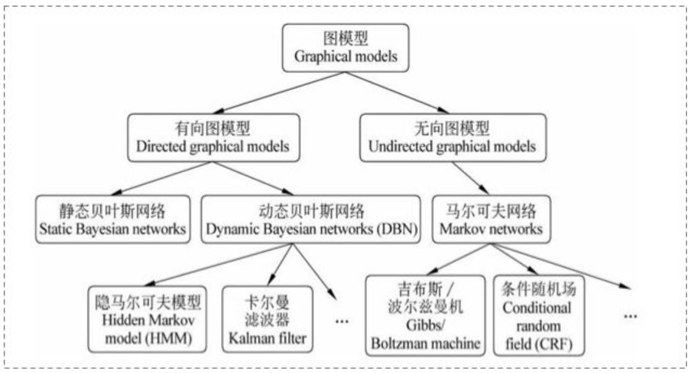
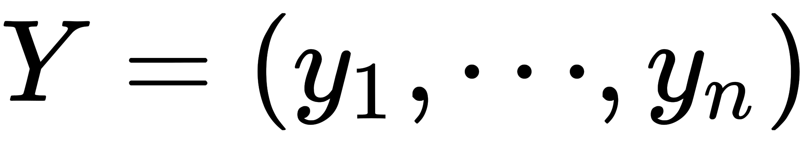
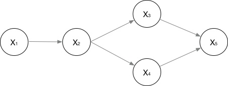
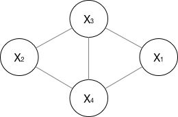

### 概率图模型学习笔记：HMM、HEMM、CRF

#### 一、Prerequisite

 1.1、概率图

在统计概率图中，参考宗成庆老师的书，是这样的体系结构：

在概率图模型中，数据（样本）由公式*G=（V，E）*建模表示：

- E表示边，即概率依赖关系。

- V表示节点，即随机变量(放在此处的可以是一个token或者一个label)，具体地，用

  为随机变量建模，注意Y现在是代表了一批随机变量（想象对应一条sequence，包含了很多token），P(Y)为这些随机变量的分布；

  ​	

1.2有向图vs.无向图

上图可以看到，贝叶斯网络（信念网络）都是有向的，马尔科夫网络无向。所以贝叶斯网络适合为有单向依赖的数据建模，马尔科夫网络适合实体之间相互依赖的建模。具体的，他们的核心差异表现在如何求 P=(Y)，即怎么表示 

这个联合概率。

1. ​	有向图

   对于有向图模型，这么求联合概率：
   

   举个例子，对于下面这个有向图的随机变量（注意，这个图比较广义的）：
   
   

应该这样表示它们的联合概率：

2. 无向图

   对于无向图，我看资料一般指马尔科夫网络(下图比较广义)：

   

   如果一个graph太大，可以使用因子分解将 P=(Y)写为若干个"小团"，注意每个团必须是"最大团"，则有：

  

   其中，

  

   归一化是为了让结果算作概率。

   所以向上面的无向图：

 

   其中，是一个最大团C上随机变量们的联合概率，一般取指数函数的：

   这个叫  势函数  ，那么概率无向图的联合概率分布可以在因子分解下表示为：

1.3、马尔科夫假设&马尔科夫性

1. ​	马尔科夫假设

2. 马尔科夫性

   马尔科夫性是保证或者判断概率图是否为概率无向图的条件。

   三点内容：a.成对，b.局部，c.全局

2、判别式模型vs生成式模型

在监督学习下，模型可分为判别式模型与生成式模型。

先问个问题，根据经验，A批模型(神经网络模型、SVM、perceptron、LR、DT....)与B批模型(NB、LDA...)，有啥区别不？

应该是这样的：

1、A批模型是这么工作的，他们直接将数据的Y(或label)，根据所提供的features，学习，最后画出一个明显或者比较明显的边界

2、B批模型是这么工作的，他们先从训练样本数据中，将所有的数据的分布摸透，然后最终确定一个分布，来作为我的所有输入的数据分布，并且它是一个联合分布P(X,Y)。然后我来了新的数据，好，通过学习来的模型的联合分布P(X,Y)，再结合新的样本给的X，通过条件概率就能出来Y：

