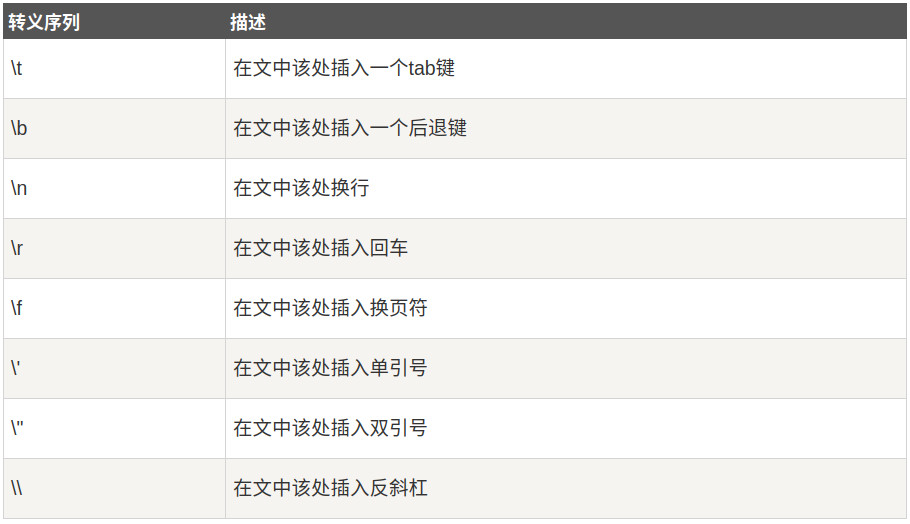

# Java Character

Character类对于单个字符进行操作
Character类在对象中包装一个基本类型 char 的值


```java
char ch = 'a';
 
// Unicode 字符表示形式
char uniChar = '\u039A'; 
 
// 字符数组
char[] charArray ={ 'a', 'b', 'c', 'd', 'e' };
```

然而，在实际开发过程中，我们经常会遇到需要使用对象，而不是内置数据类型的情况。为了解决这个问题，Java语言为内置数据类型char提供了包装类Character类。

Character类提供了一系列方法来操纵字符。你可以使用Character的构造方法创建一个Character类对象，例如：

`Character ch = new Character('a');`

在某些情况下，Java编译器会自动创建一个Character对象。

将一个char类型的参数传递给需要一个Character类型参数的方法时，那么编译器会自动地将char类型参数转换为Character对象。 这种特征称为装箱，反过来称为拆箱。
```java
// 原始字符 'a' 装箱到 Character 对象 ch 中
Character ch = 'a';
 
// 原始字符 'x' 用 test 方法装箱
// 返回拆箱的值到 'c'
char c = test('x');
```

## 转义序列
前面有反斜杠（\）的字符代表转义字符，它对编译器来说是有特殊含义的。

下面列表展示了Java的转义序列：


当打印语句遇到一个转义序列时，编译器可以正确地对其进行解释。

以下实例转义双引号并输出：
public class Test {
 
   public static void main(String args[]) {
      System.out.println("访问\"菜鸟教程!\"");
   }
}
```java
访问"菜鸟教程!"
```

## Character 方法

- `isLetter()` 是否是一个字母
- `isDigit()` 是否是一个数字字符
- `isWhitespace()` 是否是一个空白字符
- `isUpperCase()` 是否是大写字母
- `isLowerCase()` 是否是小写字母
- `toUpperCase()` 指定字母的大写形式
- `toLowerCase()` 指定字母的小写形式
- `toString()` 返回字符的字符串形式，字符串的长度仅为1


