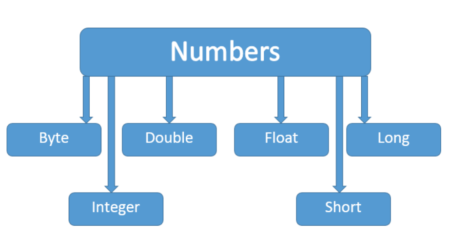
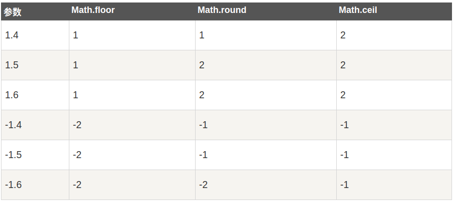

# Java Number & Math类

## Java Number
一般地，当需要使用数字的时候，我们通常使用内置数据类型，如：byte、int、long、double 等。

```java
int a = 5000;
float b = 13.65f;
byte c = 0x4a;
```

然而，在实际开发过程中，我们经常会遇到需要使用对象，而不是内置数据类型的情形。为了解决这个问题，Java 语言为每一个内置数据类型提供了对应的包装类。

所有的包装类（Integer、Long、Byte、Double、Float、Short）都是抽象类 Number 的子类。



这种由编译器特别支持的包装称为装箱，所以当内置数据类型被当作对象使用的时候，编译器会把内置类型装箱为包装类。相似的，编译器也可以把一个对象拆箱为内置类型。Number 类属于 java.lang 包。

下面是一个使用 Integer 对象的实例：
 ```java
 public class Test{
 
   public static void main(String args[]){
      Integer x = 5;
      x =  x + 10;
      System.out.println(x); 
   }
}
```
编译运行结果
```
15
```
当 x 被赋为整型值时，由于x是一个对象，所以编译器要对x进行装箱。然后，为了使x能进行加运算，所以要对x进行拆箱。


## Java Math 类
Java 的 Math 包含了用于执行基本数学运算的属性和方法，如初等指数、对数、平方根和三角函数。

Math 的方法都被定义为 static 形式，通过 Math 类可以在主函数中直接调用。
```java
public class Test {  
    public static void main (String []args)  
    {  
        System.out.println("90 度的正弦值：" + Math.sin(Math.PI/2));  
        System.out.println("0度的余弦值：" + Math.cos(0));  
        System.out.println("60度的正切值：" + Math.tan(Math.PI/3));  
        System.out.println("1的反正切值： " + Math.atan(1));  
        System.out.println("π/2的角度值：" + Math.toDegrees(Math.PI/2));  
        System.out.println(Math.PI);  
    }  
}
```

## Number & Math 类方法


## Math 的 floor,round 和 ceil 方法实例比较


