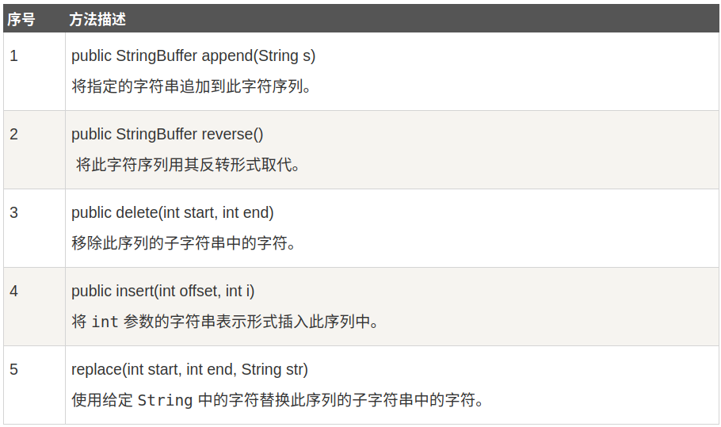
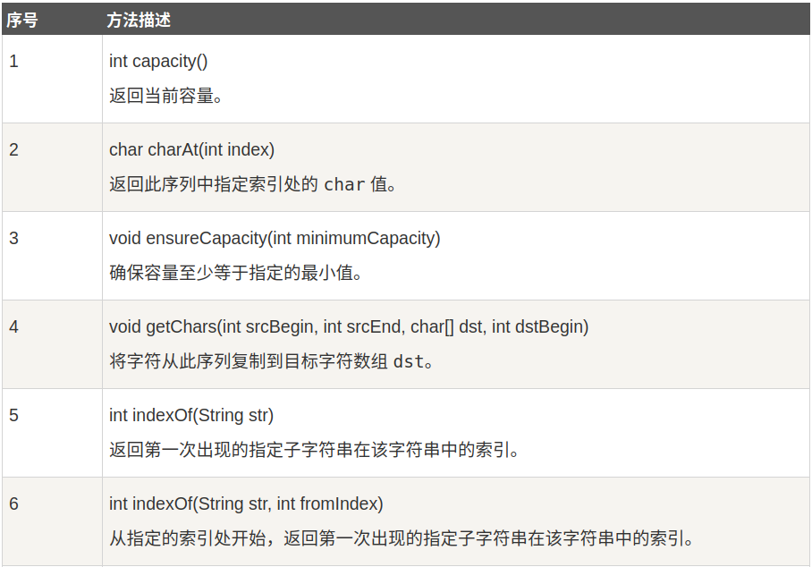
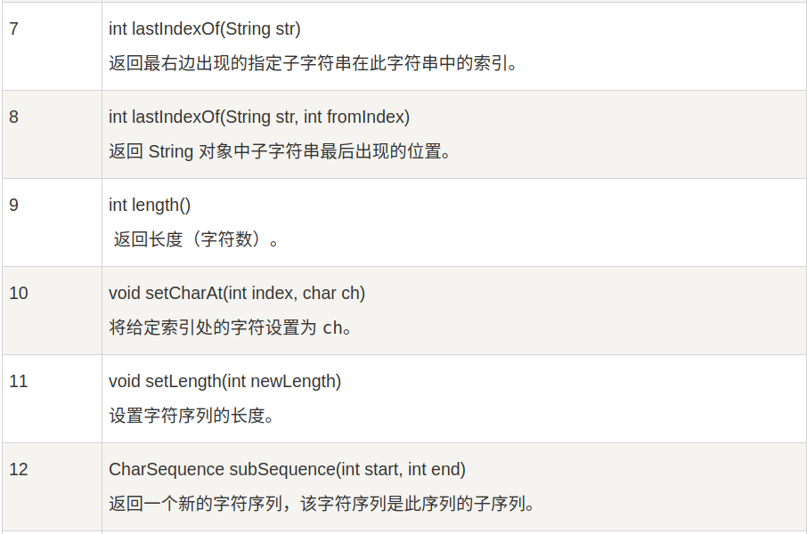
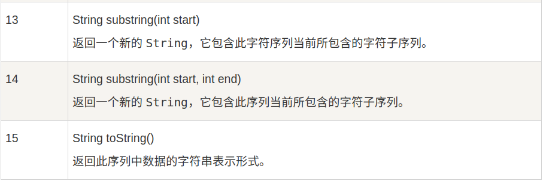

# Java StringBuffer 和 StringBuilder类

当对字符串进行修改的时候，需要使用 StringBuffer 和 StringBuilder 类。

和 String类不同的是，StringBuffer 和 StringBuilder 类的对象能够被多次修改，并且不产生新的未使用的对象。

StringBuilder 类在 Java5 中被提出，它和 StringBuffer之间的最大不同在于 StringBuilder的方法不是线程安全的（不能同步访问）

由于 StringBuilder 相较于 StringBuffer 有速度优势，所以大多数情况下建议使用 StringBuilder 类，然而在应用程序要求线程安全的情况下，则必须使用 StringBuffer类

```java
public class Test{
  public static void main(String args[]){
    StringBuffer sBuffer = new StringBuffer("菜鸟教程官网：");
    sBuffer.append("www");
    sBuffer.append(".runoob");
    sBuffer.append(".com");
    System.out.println(sBuffer);  
  }
}
```

## StringBuffer 方法
以下是 StringBuffer 类支持的主要方法：


下面的列表里的方法和 String 类的方法类似：



