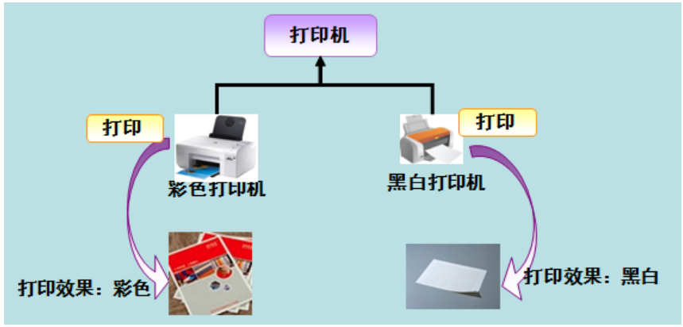

# Java 多态

多态是同一个行为具有不同表现形式或形态的能力

多态就是同一个接口，使用不同的实例而执行不同的操作，如下所示：


多态性是对象多种表现形式的体现

## 多态的优点
- 消除类型之间的耦合关系
- 可替换性
- 可扩展性
- 接口性
- 灵活性
- 简化性


## 多态存在的三个必要条件
- 继承
- 重写
- 父类引用指向子类对象

比如：

`Parent p = new Child();`

当使用多态方式调用方法时，首先检查父类中是否有该方法，如果没有，则编译错误；如果有，再去调用子类同名方法
多态好处：可以使程序有良好的扩展，并可以对所有类的对象进行通用处理。


## 虚函数

虚函数的存在是为了多态
Java中国其实没有虚函数的概念，它的普通函数就是相当于C++的虚函数，动态绑定是Java的默认行为，如果 java不希望某个函数具有虚函数特性，可以加上 final 关键字变成非虚函数。

### 重写
我们将介绍在java类中，当设计时，被重写的方法的行为怎样影响多态性
我们已经讨论了方法的重写，也就是子类能够重写父类的方法。

当子类对象调用重写的方法时，调用的是子类的方法，而不是父类中被重写的方法。

要想调用父类中被重写的方法，则必须使用关键字 super。

```java
/* 文件名 : Employee.java */
public class Employee {
   private String name;
   private String address;
   private int number;
   public Employee(String name, String address, int number) {
      System.out.println("Employee 构造函数");
      this.name = name;
      this.address = address;
      this.number = number;
   }
   public void mailCheck() {
      System.out.println("邮寄支票给： " + this.name
       + " " + this.address);
   }
   public String toString() {
      return name + " " + address + " " + number;
   }
   public String getName() {
      return name;
   }
   public String getAddress() {
      return address;
   }
   public void setAddress(String newAddress) {
      address = newAddress;
   }
   public int getNumber() {
     return number;
   }
}

```

```java
/* 文件名 : Salary.java */
public class Salary extends Employee
{
   private double salary; // 全年工资
   public Salary(String name, String address, int number, double salary) {
       super(name, address, number);
       setSalary(salary);
   }
   public void mailCheck() {
       System.out.println("Salary 类的 mailCheck 方法 ");
       System.out.println("邮寄支票给：" + getName()
       + " ，工资为：" + salary);
   }
   public double getSalary() {
       return salary;
   }
   public void setSalary(double newSalary) {
       if(newSalary >= 0.0) {
          salary = newSalary;
       }
   }
   public double computePay() {
      System.out.println("计算工资，付给：" + getName());
      return salary/52;
   }
}
```
```java
/* 文件名 : VirtualDemo.java */
public class VirtualDemo {
   public static void main(String [] args) {
      Salary s = new Salary("员工 A", "北京", 3, 3600.00);
      Employee e = new Salary("员工 B", "上海", 2, 2400.00);
      System.out.println("使用 Salary 的引用调用 mailCheck -- ");
      s.mailCheck();
      System.out.println("\n使用 Employee 的引用调用 mailCheck--");
      e.mailCheck();
    }
}
```
以上实例编译运行结果如下：

```
Employee 构造函数
Employee 构造函数
使用 Salary 的引用调用 mailCheck -- 
Salary 类的 mailCheck 方法 
邮寄支票给：员工 A ，工资为：3600.0

使用 Employee 的引用调用 mailCheck--
Salary 类的 mailCheck 方法 
邮寄支票给：员工 B ，工资为：2400.0
```

### 例子解析

- 实例中，实例化了两个 Salary 对象：一个使用 Salary 引用 s，另一个使用 Employee 引用 e。

- 当调用 s.mailCheck() 时，编译器在编译时会在 Salary 类中找到 mailCheck()，执行过程 JVM 就调用 Salary 类的 mailCheck()。

- 因为 e 是 Employee 的引用，所以调用 e 的 mailCheck() 方法时，编译器会去 Employee 类查找 mailCheck() 方法 。

- 在编译的时候，编译器使用 Employee 类中的 mailCheck() 方法验证该语句， 但是在运行的时候，Java虚拟机(JVM)调用的是 Salary 类中的 mailCheck() 方法。

以上整个过程被称为虚拟方法调用，该方法被称为虚拟方法。

Java中所有的方法都能以这种方式表现，因此，重写的方法能在运行时调用，不管编译的时候源代码中引用变量是什么数据类型。


## 多态的实现方式

### 方式一：重写

### 方式二：接口
1. 生活中的接口最具代表性的就是插座，例如一个三接头的插头都能接在三孔插座中，因为这个是每个国家都有各自规定的接口规则，有可能到国外就不行，那是因为国外自己定义的接口类型。

2. java中的接口类似于生活中的接口，就是一些方法特征的集合，但没有方法的实现。具体可以看 java接口 这一章节的内容

### 方式三：抽象类和抽象方法