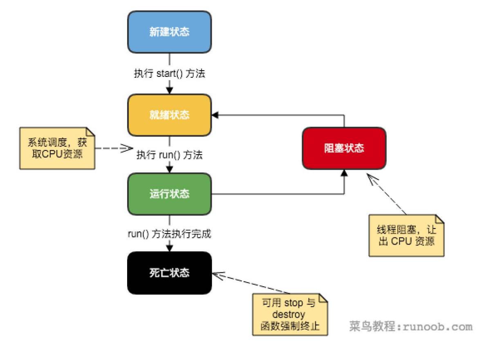
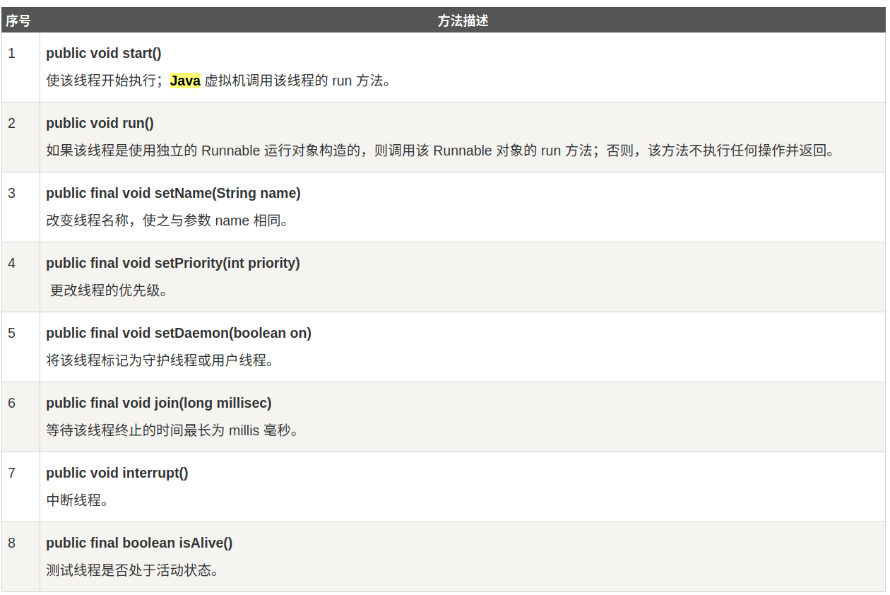
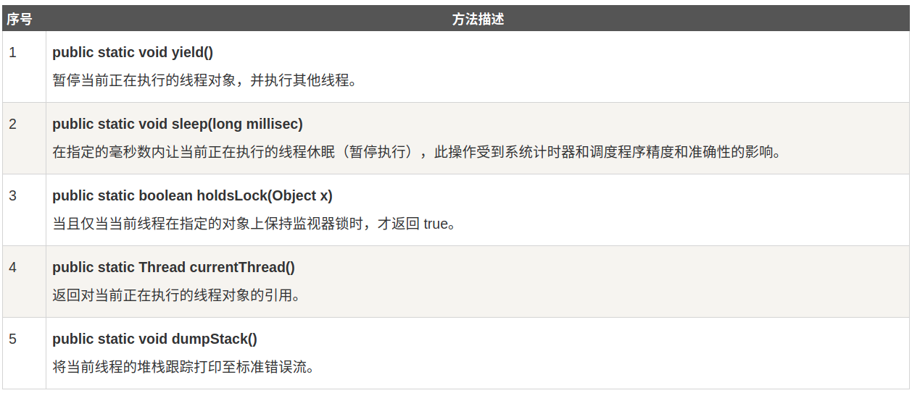

# Java 多线程编程

Java 给多线程编程提供了内置的支持。 一条线程指的是进程中一个单一顺序的控制流，一个进程中可以并发多个线程，每条线程并行执行不同的任务。

多线程是多任务的一种特别的形式，但多线程使用了更小的资源开销。

这里定义和线程相关的另一个术语 - 进程：一个进程包括由操作系统分配的内存空间，包含一个或多个线程。一个线程不能独立的存在，它必须是进程的一部分。一个进程一直运行，直到所有的非守护线程都结束运行后才能结束。

多线程能满足程序员编写高效率的程序来达到充分利用 CPU 的目的。

## 一个线程的声明周期

线程是一个动态执行的过程，它也是有一个从生产到死亡的过程
下图显示了一个线程完整的声明周期



- 新建状态:
使用 new 关键字和 Thread 类或其子类建立一个线程对象后，该线程对象就处于新建状态。它保持这个状态直到程序 start() 这个线程。

- 就绪状态:
当线程对象调用了start()方法之后，该线程就进入就绪状态。就绪状态的线程处于就绪队列中，要等待JVM里线程调度器的调度。

- 运行状态:
如果就绪状态的线程获取 CPU 资源，就可以执行 run()，此时线程便处于运行状态。处于运行状态的线程最为复杂，它可以变为阻塞状态、就绪状态和死亡状态。

- 阻塞状态:
如果一个线程执行了sleep（睡眠）、suspend（挂起）等方法，失去所占用资源之后，该线程就从运行状态进入阻塞状态。在睡眠时间已到或获得设备资源后可以重新进入就绪状态。可以分为三种：

    等待阻塞：运行状态中的线程执行 wait() 方法，使线程进入到等待阻塞状态。

    同步阻塞：线程在获取 synchronized 同步锁失败(因为同步锁被其他线程占用)。

    其他阻塞：通过调用线程的 sleep() 或 join() 发出了 I/O 请求时，线程就会进入到阻塞状态。当sleep() 状态超时，join() 等待线程终止或超时，或者 I/O 处理完毕，线程重新转入就绪状态。

-死亡状态:
一个运行状态的线程完成任务或者其他终止条件发生时，该线程就切换到终止状态。


## 线程的优先级
每一个 Java 线程都有一个优先级，这样有助于操作系统确定线程的调度顺序。

Java 线程的优先级是一个整数，其取值范围是 1 （Thread.MIN_PRIORITY ） - 10 （Thread.MAX_PRIORITY ）。

默认情况下，每一个线程都会分配一个优先级 NORM_PRIORITY（5）。

具有较高优先级的线程对程序更重要，并且应该在低优先级的线程之前分配处理器资源。但是，线程优先级不能保证线程执行的顺序，而且非常依赖于平台。

##  创建一个线程
Java 提供了三种创建线程的方法：
- 通过实现 Runnable接口
- 通过继承 Thread 类本身
- 通过 Callable 和 Future 创建线程

## 通过实现 Runnable 接口来创建线程
创建一个线程，最简单的方法是创建一个实现 Runnable 接口的类。

为了实现 Runnable，一个类只需要执行一个方法调用 run()，声明如下：
`public void run()`
你可以重写该方法，重要的是理解的 run() 可以调用其他方法，使用其他类，并声明变量，就像主线程一样。

在创建一个实现 Runnable 接口的类之后，你可以在类中实例化一个线程对象。

hread 定义了几个构造方法，下面的这个是我们经常使用的：
`Thread(Runnable threadOb,String threadName);`
这里，threadOb 是一个实现 Runnable 接口的类的实例，并且 threadName 指定新线程的名字。

新线程创建之后，你调用它的 start() 方法它才会运行。
`void start();`

下面是一个创建线程并开始让它执行的实例：

```java

class RunnableDemo implements Runnable {
   private Thread t;
   private String threadName;
   
   RunnableDemo( String name) {
      threadName = name;
      System.out.println("Creating " +  threadName );
   }
   
   public void run() {
      System.out.println("Running " +  threadName );
      try {
         for(int i = 4; i > 0; i--) {
            System.out.println("Thread: " + threadName + ", " + i);
            // 让线程睡眠一会
            Thread.sleep(50);
         }
      }catch (InterruptedException e) {
         System.out.println("Thread " +  threadName + " interrupted.");
      }
      System.out.println("Thread " +  threadName + " exiting.");
   }
   
   public void start () {
      System.out.println("Starting " +  threadName );
      if (t == null) {
         t = new Thread (this, threadName);
         t.start ();
      }
   }
}
 
public class TestThread {
 
   public static void main(String args[]) {
      RunnableDemo R1 = new RunnableDemo( "Thread-1");
      R1.start();
      
      RunnableDemo R2 = new RunnableDemo( "Thread-2");
      R2.start();
   }   
}
```

编译以上程序并运行结果如下：
```
Creating Thread-1
Starting Thread-1
Creating Thread-2
Starting Thread-2
Running Thread-2
Running Thread-1
Thread: Thread-1, 4
Thread: Thread-2, 4
Thread: Thread-2, 3
Thread: Thread-1, 3
Thread: Thread-1, 2
Thread: Thread-2, 2
Thread: Thread-1, 1
Thread: Thread-2, 1
Thread Thread-2 exiting.
Thread Thread-1 exiting.

```

## 通过继承Thread来创建线程

创建一个线程的第二种方式是创建一个新的类，该类继承了Thread类，然后创建一个该类的实例。
继承类必须重写run()方法，该方法是新线程的入口点，它也必须调用start()方法才能执行
该方法尽管被列为一种对线程实现方式，但是本质上也是实现了Runnable接口的一个实例

```java
class ThreadDemo extends Thread {
   private Thread t;
   private String threadName;
   
   ThreadDemo( String name) {
      threadName = name;
      System.out.println("Creating " +  threadName );
   }
   
   public void run() {
      System.out.println("Running " +  threadName );
      try {
         for(int i = 4; i > 0; i--) {
            System.out.println("Thread: " + threadName + ", " + i);
            // 让线程睡眠一会
            Thread.sleep(50);
         }
      }catch (InterruptedException e) {
         System.out.println("Thread " +  threadName + " interrupted.");
      }
      System.out.println("Thread " +  threadName + " exiting.");
   }
   
   public void start () {
      System.out.println("Starting " +  threadName );
      if (t == null) {
         t = new Thread (this, threadName);
         t.start ();
      }
   }
}
 
public class TestThread {
 
   public static void main(String args[]) {
      ThreadDemo T1 = new ThreadDemo( "Thread-1");
      T1.start();
      
      ThreadDemo T2 = new ThreadDemo( "Thread-2");
      T2.start();
   }   
}
```


## Thread方法


测试线程是否处于活动状态。 上述方法是被Thread对象调用的。下面的方法是Thread类的静态方法。



如下的ThreadClassDemo 程序演示了Thread类的一些方法：


