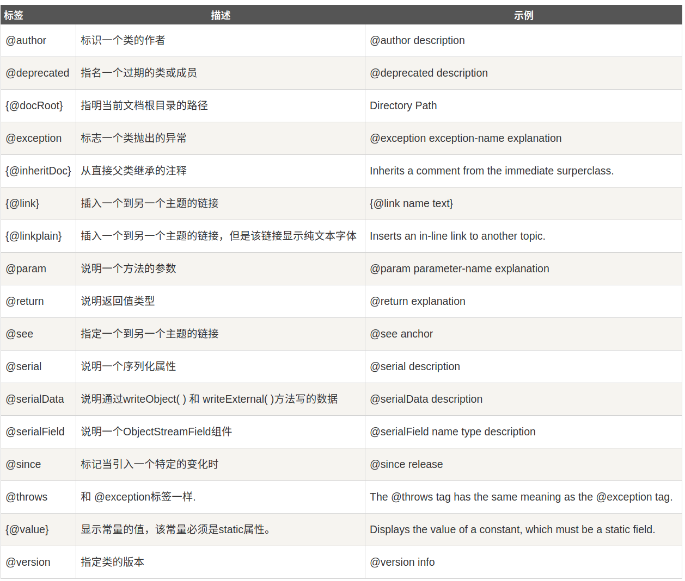

# Java 文档注释

Java 支持三种注释方式。前两种分别是 // 和 /* */，第三种被称作说明注释，它以 /** 开始，以 */结束。

说明注释允许你在程序中嵌入关于程序的信息。你可以使用 javadoc 工具软件来生成信息，并输出到HTML文件中。

说明注释，使你更加方便的记录你的程序信息。


## Java 标签

javadoc 工具软件识别以下标签：



## 文档注释
在开始的 /** 之后，第一行或几行是关于类、变量和方法的主要描述。

之后，你可以包含一个或多个各种各样的 @ 标签。每一个 @ 标签必须在一个新行的开始或者在一行的开始紧跟星号(*).

多个相同类型的标签应该放成一组。例如，如果你有三个 @see 标签，可以将它们一个接一个的放在一起。

下面是一个类的说明注释的实例：
```java
/*** 这个类绘制一个条形图
* @author runoob
* @version 1.2
*/
```
## javadoc 输出什么
javadoc 工具将你 Java 程序的源代码作为输入，输出一些包含你程序注释的HTML文件。

每一个类的信息将在独自的HTML文件里。javadoc 也可以输出继承的树形结构和索引。

由于 javadoc 的实现不同，工作也可能不同，你需要检查你的 Java 开发系统的版本等细节，选择合适的 Javadoc 版本。

```java
import java.io.*;
 
/**
* 这个类演示了文档注释
* @author Ayan Amhed
* @version 1.2
*/
public class SquareNum {
   /**
   * This method returns the square of num.
   * This is a multiline description. You can use
   * as many lines as you like.
   * @param num The value to be squared.
   * @return num squared.
   */
   public double square(double num) {
      return num * num;
   }
   /**
   * This method inputs a number from the user.
   * @return The value input as a double.
   * @exception IOException On input error.
   * @see IOException
   */
   public double getNumber() throws IOException {
      InputStreamReader isr = new InputStreamReader(System.in);
      BufferedReader inData = new BufferedReader(isr);
      String str;
      str = inData.readLine();
      return (new Double(str)).doubleValue();
   }
   /**
   * This method demonstrates square().
   * @param args Unused.
   * @return Nothing.
   * @exception IOException On input error.
   * @see IOException
   */
   public static void main(String args[]) throws IOException
   {
      SquareNum ob = new SquareNum();
      double val;
      System.out.println("Enter value to be squared: ");
      val = ob.getNumber();
      val = ob.square(val);
      System.out.println("Squared value is " + val);
   }
}

```

如下，使用javadoc工具处理 SquareNum.java 文件：
```java
$ javadoc SquareNum.java
Loading source file SquareNum.java...
Constructing Javadoc information...
Standard Doclet version 1.5.0_13
Building tree for all the packages and classes...
Generating SquareNum.html...
SquareNum.java:39: warning - @return tag cannot be used\
                      in method with void return type.
Generating package-frame.html...
Generating package-summary.html...
Generating package-tree.html...
Generating constant-values.html...
Building index for all the packages and classes...
Generating overview-tree.html...
Generating index-all.html...
Generating deprecated-list.html...
Building index for all classes...
Generating allclasses-frame.html...
Generating allclasses-noframe.html...
Generating index.html...
Generating help-doc.html...
Generating stylesheet.css...
1 warning
$

```


