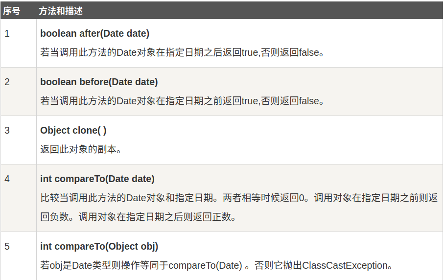
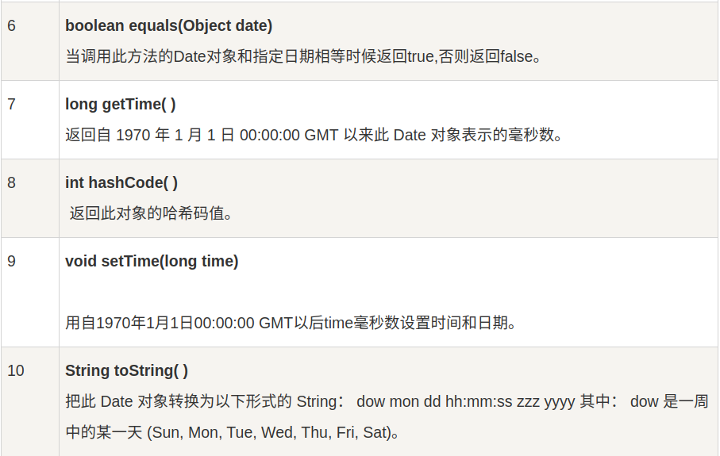
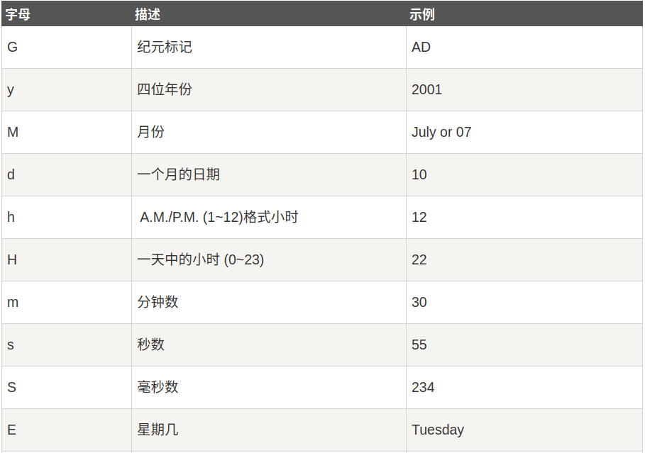
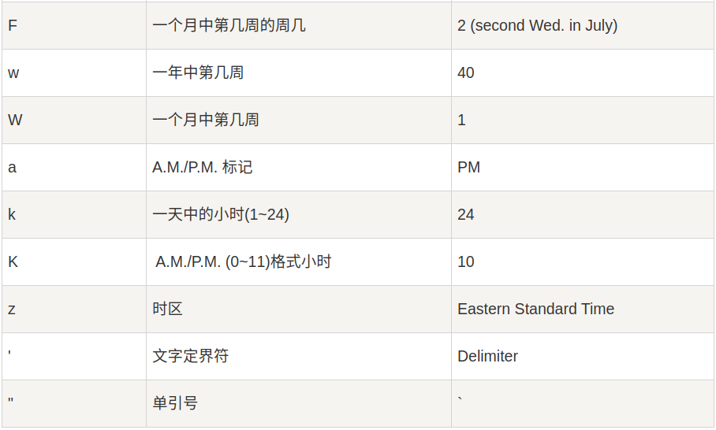
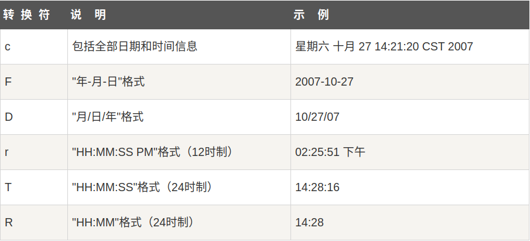

# Java 日期和时间
 java.util 包提供了 Date 类来封装当前日期和时间。Date 类提供了两个构造函数来实例化 Date 对象。

第一个构造函数使用当前日期和时间来初始化对象。
`Date()`

第二个构造函数接收一个参数，改成参数是从1970年1月1日起的毫秒数。

`Date(long millisec)`


Date 对象创建以后，可以调用下面的方法。




##获取当前日期和时间
Java中获取当前日期和时间很简单，使用Date对象 的 toString()方法来打印当前时间，如下所示：

```java
import java.util.Date;
public class DateDemo{
    public static void main(String args[]){
        //初始化 Date 对象
        Date date = new Date();
        // 使用 toString()函数显示日期和时间
        System.out.println(date.toString());
    }
}

```

## 日期比较
Java 使用以下三种方法来比较两个日期：
- 使用 getTime() 方法获取两个日期（自1970年1月1日经历的毫秒数值），然后比较这两个值。
- 使用方法 before()，after() 和 equals()。例如，一个月的12号比18号早，则 new Date(99, 2, 12).before(new Date (99, 2, 18)) 返回true。
- 使用 compareTo() 方法，它是由 Comparable 接口定义的，Date 类实现了这个接口。

### 使用 SimpleDateFormat 格式化日期
SimpleDateFormat 是一个以语言环境敏感的方式来格式化和分析日期的类。SimpleDateFormat 允许你选择任何用户自定义日期时间格式来运行。例如
```java
import  java.util.*;
import java.text.*;
 
public class DateDemo {
   public static void main(String args[]) {
 
      Date dNow = new Date( );
      SimpleDateFormat ft = new SimpleDateFormat ("yyyy-MM-dd hh:mm:ss");
 
      System.out.println("当前时间为: " + ft.format(dNow));
   }
}
```

### 日期和时间的格式化编码
时间模式字符串用来指定时间格式。在此模式中，所有ASCII字母被保留为模式字母，定义如下：




### 使用printf格式化日期
printf 方法可以很轻松地格式化时间和日期。使用两个字母格式，它以 %t 开头并且以下面表格中的一个字母结尾。


```java
import java.util.Date;
 
public class DateDemo {
 
  public static void main(String args[]) {
     // 初始化 Date 对象
     Date date = new Date();
 
     //c的使用  
    System.out.printf("全部日期和时间信息：%tc%n",date);          
    //f的使用  
    System.out.printf("年-月-日格式：%tF%n",date);  
    //d的使用  
    System.out.printf("月/日/年格式：%tD%n",date);  
    //r的使用  
    System.out.printf("HH:MM:SS PM格式（12时制）：%tr%n",date);  
    //t的使用  
    System.out.printf("HH:MM:SS格式（24时制）：%tT%n",date);  
    //R的使用  
    System.out.printf("HH:MM格式（24时制）：%tR",date);  
  }
}
```
```
全部日期和时间信息：星期一 九月 10 10:43:36 CST 2012  
年-月-日格式：2012-09-10  
月/日/年格式：09/10/12  
HH:MM:SS PM格式（12时制）：10:43:36 上午  
HH:MM:SS格式（24时制）：10:43:36  
HH:MM格式（24时制）：10:43 
```

如果你需要重复提供日期，那么利用这种方式来格式化它的每一部分就有点复杂了。因此，可以利用一个格式化字符串指出要被格式化的参数的索引。

索引必须紧跟在%后面，而且必须以$结束。例如：
```java
import java.util.Date;
  
public class DateDemo {
 
   public static void main(String args[]) {
       // 初始化 Date 对象
       Date date = new Date();
        
       // 使用toString()显示日期和时间
       System.out.printf("%1$s %2$tB %2$td, %2$tY", 
                         "Due date:", date);
   }
}

```
`Due date: February 09, 2014`

或者，你可以使用 < 标志。它表明先前被格式化的参数要被再次使用。例如：
```java
import java.util.Date;
  
public class DateDemo {
 
   public static void main(String args[]) {
       // 初始化 Date 对象
       Date date = new Date();
        
       // 显示格式化时间
       System.out.printf("%s %tB %<te, %<tY", 
                         "Due date:", date);
   }
}
```

## 解析字符串为时间
SimpleDateFormat 类有一些附加的方法，特别是parse()，它试图按照给定的SimpleDateFormat 对象的格式化存储来解析字符串。例如：
```java
import java.util.*;
import java.text.*;
  
public class DateDemo {
 
   public static void main(String args[]) {
      SimpleDateFormat ft = new SimpleDateFormat ("yyyy-MM-dd"); 
 
      String input = args.length == 0 ? "1818-11-11" : args[0]; 
 
      System.out.print(input + " Parses as "); 
 
      Date t; 
 
      try { 
          t = ft.parse(input); 
          System.out.println(t); 
      } catch (ParseException e) { 
          System.out.println("Unparseable using " + ft); 
      }
   }
}
```
