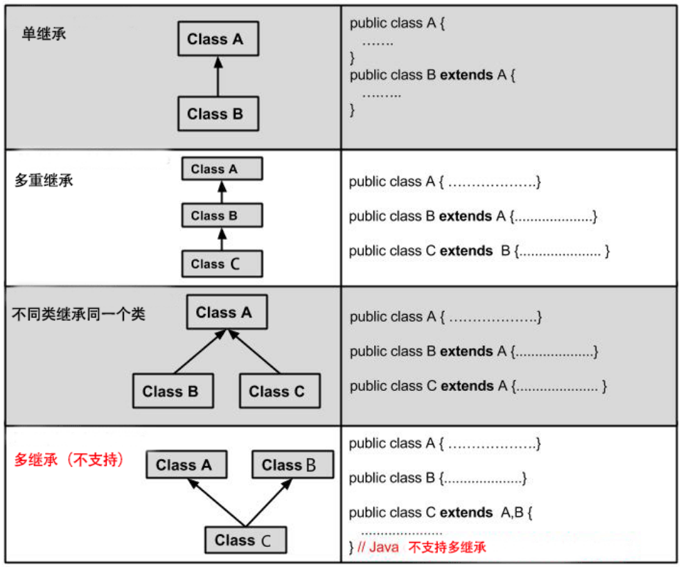

# Java 继承

## 继承概念
继承是java面向对象编程技术的一块基石，因为它允许创建分等级层次的类。

继承就是子类继承父类的特征和行为，使得子类对象（实例）具有父类的实例域和方法，或子类从父类继承方法，使得子类具有父类相同的行为。


兔子和羊属于食草动物类，狮子和豹属于食肉动物类。

食草动物和食肉动物又是属于动物类。

所以继承需要符合的关系是：is-a，父类更通用，子类更具体。

虽然食草动物和食肉动物都是属于动物，但是两者的属性和行为上有差别，所以子类会具有父类的一般特性也会具有自身的特性。

## 类的继承格式
在 Java 中通过 extends 关键字可以申明一个类是从另外一个类继承而来的，一般形式如下

```java
class 父类 {
}
 
class 子类 extends 父类 {
}
```


## 继承类型


## 继承的特性
- 子类拥有父类非 private 的属性、方法
- 子类可以拥有自己的属性和方法，即子类可以对父类进行扩展
- 子类可以用自己的方式实现父类的方法
- Java的继承是单继承，但可以是多重继承，
- 提高了类之间的耦合性（继承的缺点，耦合度高就会造成代码之间的联系越紧密，代码独立性差）


## 关键字继承

继承可以使用 extends 和 implements 这两个关键字来实现继承，而且所有的类都是继承于 java.lang.Object，当一个类没有继承的两个关键字，则默认继承object（这个类在 java.lang 包中，所以不需要 import）祖先类。

### extends 关键字
在java中，类的继承是单一继承，也就是说，一个子类只能拥有一个父类，所以extends只能继承一个类。


### implements 关键字
使用 impements关键字可以变相的使用java具有多重继承的特性，使用发范围为类继承接口的情况，可以同时继承多个接口（接口跟接口之间采用逗号分隔）
```java
public interface A {
    public void eat();
    public void sleep();
}
public interface B {
    public void show();
}

public class C implements A,B{
}
```

### super 与 this 关键字
super关键字：我们可以通过super关键字来实现对父类成员的访问，用来引用当前对象的父类
this关键字：指向自己的引用

```java
class Animal {
  void eat() {
    System.out.println("animal : eat");
  }
}
 
class Dog extends Animal {
  void eat() {
    System.out.println("dog : eat");
  }
  void eatTest() {
    this.eat();   // this 调用自己的方法
    super.eat();  // super 调用父类方法
  }
}
 
public class Test {
  public static void main(String[] args) {
    Animal a = new Animal();
    a.eat();
    Dog d = new Dog();
    d.eatTest();
  }
}
```

输出结果为：

```
animal : eat
dog : eat
animal : eat

```

### final关键字
final关键字声明类可以把类定义为不能继承的，即最终类或者用于修饰方法，该方法不能被子类重写。

声明类：`final class 类名 {//类体}`

声明方法：`修饰符（public/private/default/protected）final 返回值类型 方法名(){//方法体}`

注意：实例变量也可以被定义为final，被定义为 final 的变量不能被修改。被声明为 final 类的方法自动声明为final，但是实例变量并不是final


## 构造器
子类是不继承父类的构造器（构造方法或构造函数）的，它只是调用（隐式或显式）。如果父类的构造器带有参数，则必须在子类的构造器中显式的通过`super`关键字调用父类的构造器并配以适当的参数列表
如果父类构造器没有参数，则在子类的构造器中不需要使用 ``super`关键字调用父类构造器，系统会自动调用父类的无参构造器。

```java
class SuperClass {
  private int n;
  SuperClass(){
    System.out.println("SuperClass()");
  }
  SuperClass(int n) {
    System.out.println("SuperClass(int n)");
    this.n = n;
  }
}
// SubClass 类继承
class SubClass extends SuperClass{
  private int n;
  
  SubClass(){ // 自动调用父类的无参数构造器
    System.out.println("SubClass");
  }  
  
  public SubClass(int n){ 
    super(300);  // 调用父类中带有参数的构造器
    System.out.println("SubClass(int n):"+n);
    this.n = n;
  }
}
// SubClass2 类继承
class SubClass2 extends SuperClass{
  private int n;
  
  SubClass2(){
    super(300);  // 调用父类中带有参数的构造器
    System.out.println("SubClass2");
  }  
  
  public SubClass2(int n){ // 自动调用父类的无参数构造器
    System.out.println("SubClass2(int n):"+n);
    this.n = n;
  }
}
public class TestSuperSub{
  public static void main (String args[]){
    System.out.println("------SubClass 类继承------");
    SubClass sc1 = new SubClass();
    SubClass sc2 = new SubClass(100); 
    System.out.println("------SubClass2 类继承------");
    SubClass2 sc3 = new SubClass2();
    SubClass2 sc4 = new SubClass2(200); 
  }
}

```

```
------SubClass 类继承------
SuperClass()
SubClass
SuperClass(int n)
SubClass(int n):100
------SubClass2 类继承------
SuperClass(int n)
SubClass2
SuperClass()
SubClass2(int n):200
```

