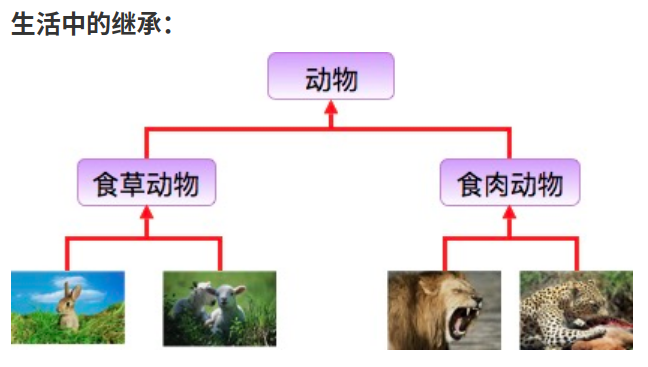

# Java 继承

## 继承概念
继承是java面向对象编程技术的一块基石，因为它允许创建分等级层次的类。

继承就是子类继承父类的特征和行为，使得子类对象（实例）具有父类的实例域和方法，或子类从父类继承方法，使得子类具有父类相同的行为。



兔子和羊属于食草动物类，狮子和豹属于食肉动物类。

食草动物和食肉动物又是属于动物类。

所以继承需要符合的关系是：is-a，父类更通用，子类更具体。

虽然食草动物和食肉动物都是属于动物，但是两者的属性和行为上有差别，所以子类会具有父类的一般特性也会具有自身的特性。

## 类的继承格式
在 Java 中通过 extends 关键字可以申明一个类是从另外一个类继承而来的，一般形式如下

```java
class 父类 {
}
 
class 子类 extends 父类 {
}
```
## 为什么需要继承
接下来我们通过实例来说明这个需求。

开发动物类，其中动物分别为企鹅以及老鼠，要求如下：

- 企鹅：属性（姓名，id），方法（吃，睡，自我介绍）
- 老鼠：属性（姓名，id），方法（吃，睡，自我介绍）
