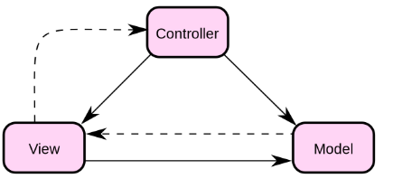
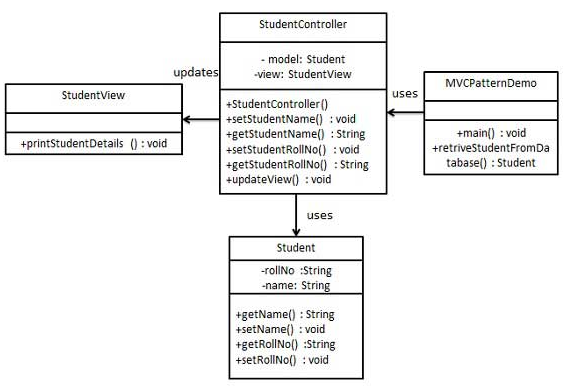

# MVC模式

MVC 模式代表 Model-View-Controller(模型-视图-控制器)模式。这种模式用于应用程序的分层开发

- Model(模型):模型代表一个存取数据的对象或JAVA POJO 。它也可以带有逻辑，在数据变化时更新控制器。
- View(视图)：视图代表模型包含的数据可视化
- Controller(控制器)：控制器作用于模型和视图上，它控制数据流向模型对象，并在数据变化时更新视图。它使视图与模型分离开。

## 实现
我们将创建一个模型的 Student 对象。StudentView是一个把学生详细信息输出到控制台的视图类。StudentController是负责存储数据到 Student 对象中的控制器类，并相应的更新视图 StudentView

MVCPatternDemo，我们的演示类使用 StudentController 来演示 MVC 模式的用法。

