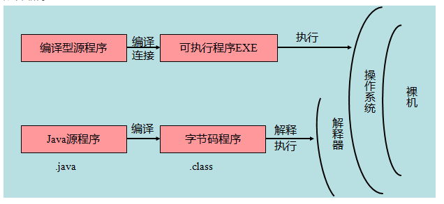

# java基础语法

一个java程序可以认为是一系列对象的集合，而这些对象通过调用彼此的方法来协同工作。
- 对象：对象是一个类的实例，有状态和行为。
- 类：类是一个模板，它描述一个类对象的行为和状态
- 方法：方法就是行为，一个类可以有很多的方法。逻辑运算、数据修改以及所有动作都是在方法中完成的。
- 实例变量：每个对象都有独特的实例变量对象的状态由这些实例变量值决定。


## 基本语法
编写 Java程序时，应该注意以下几点：
- 大小写敏感：java 是大小写敏感的，这就意味着标识符Hello 与 hello是不同的。
- 类名：对于所有的类来说，类名首字母应该大写。每个单词的首字母大写。
- 方法名：所有的方法名应该以小写字母来头。如果方法名含有若干单词，则后面的每个单词首字母大写
- 源文件名：源文件名必须和类名相同。当保存文件的时候，你应该使用类名作为文件名保存（切记 Java是大小写敏感的），文件名后缀为 .java。
- 主方法入口：所有的java程序由 public static void main(String []args)方法开始执行。

## Java 标识符
Java 所有的组成部分都需要名字。类名、变量名以及方法名都被称为标识符。

关于 Java 标识符，有以下几点需要注意：

- 所有的标识符都应该以字母（A-Z 或者 a-z）,美元符（$）、或者下划线（_）开始
- 首字符之后可以是字母（A-Z 或者 a-z）,美元符（$）、下划线（_）或数字的任何字符组合
- 关键字不能用作标识符
- 标识符是大小写敏感的
- 合法标识符举例：age、$salary、_value、__1_value
- 非法标识符举例：123abc、-salary

## Java 修饰符
像其他语言一样，Java可以使用修饰符来修饰类中方法和属性。主要有两类修饰符：

- 访问控制修饰符 : default, public , protected, private
- 非访问控制修饰符 : final, abstract, static, synchronized

## Java 变量
Java 中主要有如下几种类型的变量
- 局部变量
- 类变量（静态变量）
- 成员变量（非静态变量）


## Java 数组
数组是存储在堆上的对象，可以保存多个同类型的变量。

## Java 枚举
Java 5.0引入了枚举，枚举限制变量只能是预先设定好的值。使用枚举可以减少代码中的 bug。

例如，我们为果汁店设计一个程序，它将限制果汁为小杯、中杯、大杯。这就意味着它不允许顾客点除了这三种尺寸外的果汁。
```java
class FreshJuice {
   enum FreshJuiceSize{ SMALL, MEDIUM , LARGE }
   FreshJuiceSize size;
}
 
public class FreshJuiceTest {
   public static void main(String []args){
      FreshJuice juice = new FreshJuice();
      juice.size = FreshJuice.FreshJuiceSize.MEDIUM  ;
   }
}
```

## Java 关键字
下面列出 java关键字。这些保留字不能用于常亮、变量、和任何标识符的名称


## Java 注释
类似于 C/C++、Java 也支持单行以及多行注释。注释中的字符将被 Java 编译器忽略。
```java
public class HelloWorld {
   /* 这是第一个Java程序
    *它将打印Hello World
    * 这是一个多行注释的示例
    */
    public static void main(String []args){
       // 这是单行注释的示例
       /* 这个也是单行注释的示例 */
       System.out.println("Hello World"); 
    }
}
```

## Java 空行
空白行或者有注释的行，Java 编译器都会忽略掉。

## 继承
在 Java 中，一个类可以由其他类派生。如果你要创建一个类，而且已经存在一个类具有你所需要的属性或方法，那么你可以将新创建的类继承该类。

利用继承的方法，可以重用已存在类的方法和属性，而不用重写这些代码。被继承的类称为超类（super class），派生类称为子类（subclass）。

## 接口
在 Java 中，接口可理解为对象间相互通信的协议。接口在继承中扮演着很重要的角色。

接口只定义派生要用到的方法，但是方法的具体实现完全取决于派生类。

## Java 源程序与编译型运行区别


