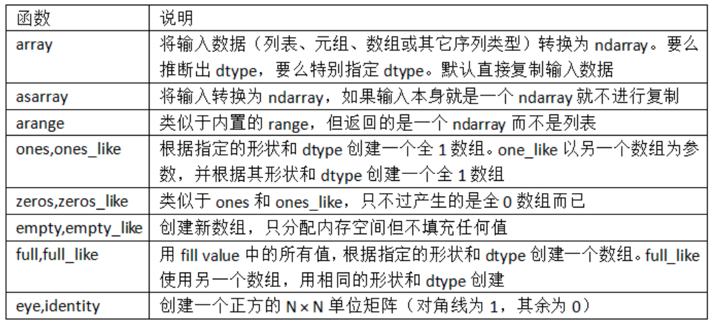
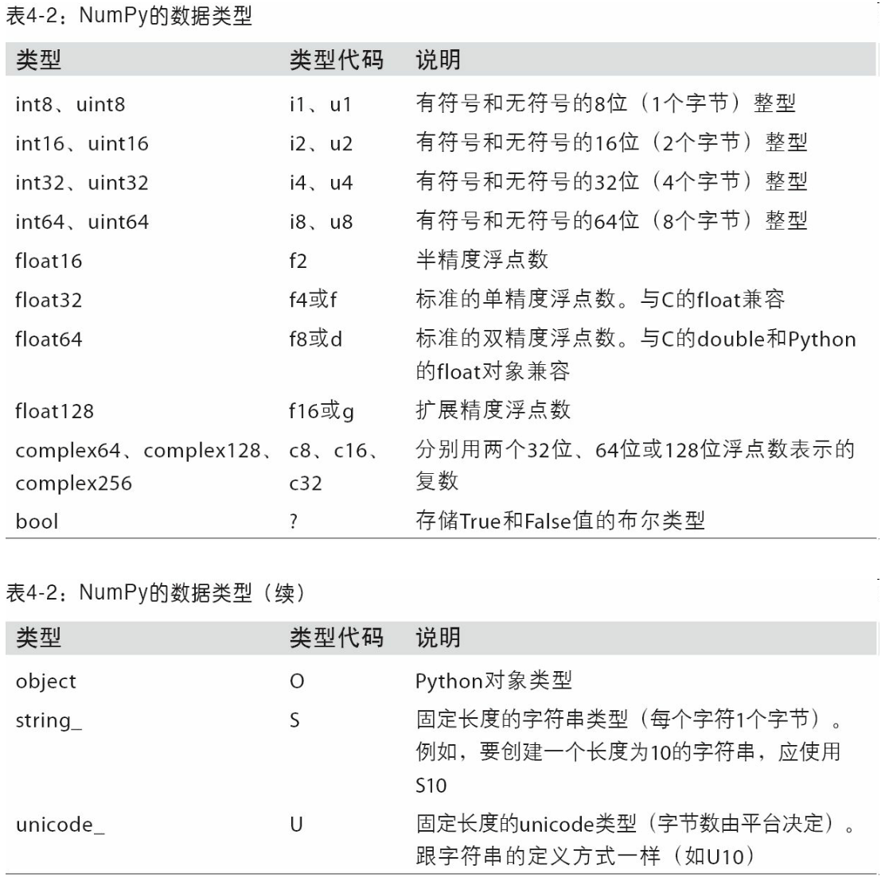
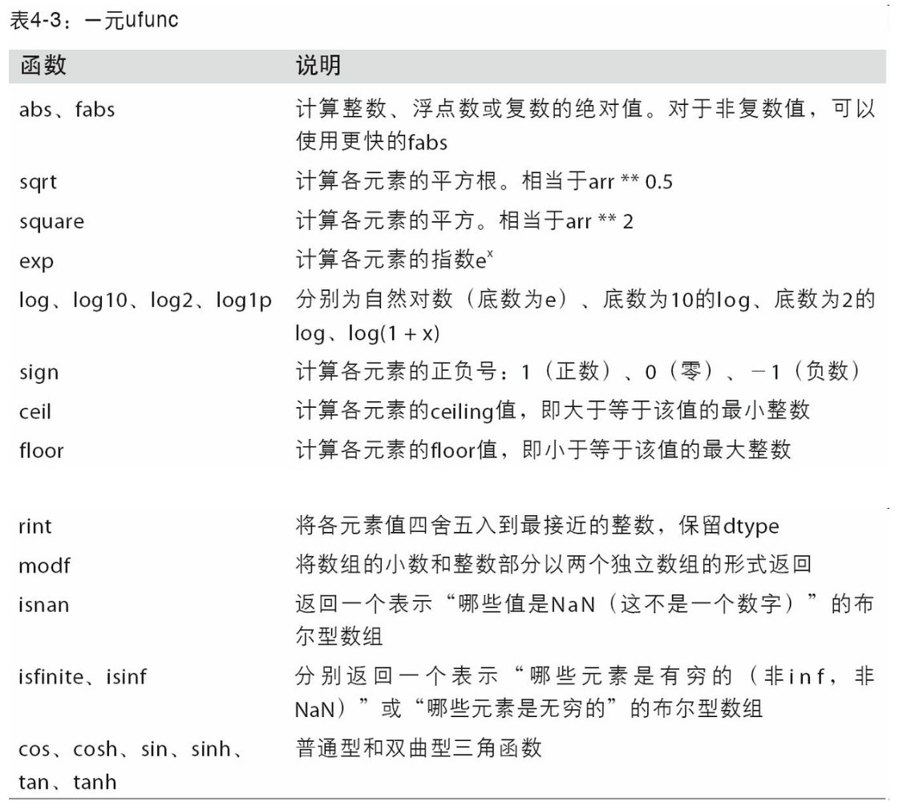
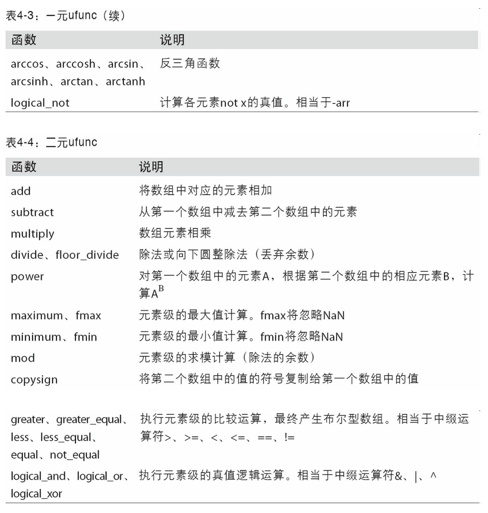
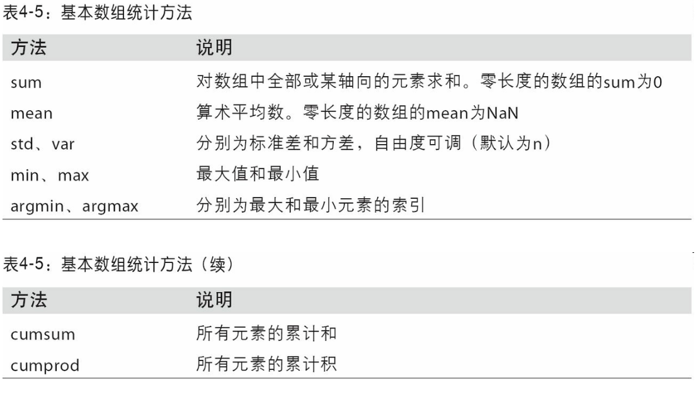
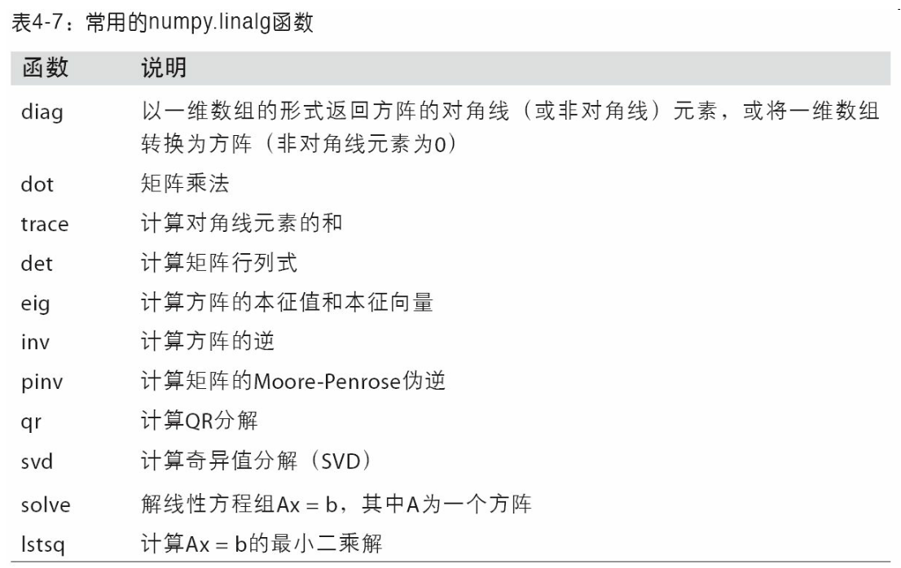
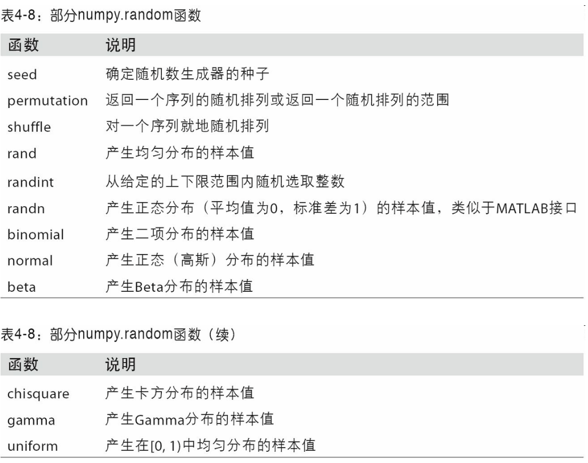

# NumPy基础：数组和矢量计算
NumPy（Numerical Python的简称）是python数值计算最重要的基础包。大多数提供科学计算的包都是用NumPy的数组作为构建的基础。

NumPy的部分功能如下：
- ndarray，一个具有矢量运算和复杂广播能力的快速且节省空间的多维数组。
- 用于对整组数据进行快速运算的标准数学函数（无需编写循环）
- 用于读写磁盘的数据的工具以及用于操作内存映射文件的工具。
- 线性代数、随机数生成以及傅里叶变换功能。
- 用于集成由c、c++、Fortran等语言编写的代码的 A C API。

对于大部分数据分析应用而言，我最关注的功能主要集中在：
- 用于数据整理和清洗、子集构造和过滤、转换等快速的矢量化数组运算
- 常用的数组算法，如排序、唯一化、集合运算等。
- 高效的描述统计和数据聚合/链接运算的数据对齐和关系型数据的运算
- 将条件逻辑表述为数组表达式
- 数据的分组运算（聚合、转换、函数应用等）


## NumPy的ndarray：一种多维数组对象
NumPy最重要的一个特点就是其N维数组对象（即ndarray），该对象是一个快速而灵活的大数据集容器。你可以利用这种数组对整块数据执行一些数学运算，其语法跟标量元素之间的运算一样。

### 创建ndarray
创建数组最简单的办法就是使用array函数。它接受一切序列型的对象（包括其他数组），然后产生一个新的含有传入数据的NumPy数组

如：
```python
In [19]: data1 = [6, 7.5, 8, 0, 1]

In [20]: arr1 = np.array(data1)

In [21]: arr1
Out[21]: array([ 6. ,  7.5,  8. ,  0. ,  1. ])
```
```python
In [22]: data2 = [[1, 2, 3, 4], [5, 6, 7, 8]]

In [23]: arr2 = np.array(data2)

In [24]: arr2
Out[24]: 
array([[1, 2, 3, 4],
       [5, 6, 7, 8]])
```

除了`np.array`之外，还有一些函数也可以新建数组，比如，`zeros`和`ones`分别可以创建指定长度或形状的全0或全1数组。`empty`还可以创建一个没有任何具体值的数组。要用这些方法创建多维数组，只需要传入一个表示形状的元祖即可：
```python
In [29]: np.zeros(10)
Out[29]: array([ 0.,  0.,  0.,  0.,  0.,  0.,  0.,  0.,  0.,  0.])

In [30]: np.zeros((3, 6))
Out[30]: 
array([[ 0.,  0.,  0.,  0.,  0.,  0.],
       [ 0.,  0.,  0.,  0.,  0.,  0.],
       [ 0.,  0.,  0.,  0.,  0.,  0.]])

In [31]: np.empty((2, 3, 2))
Out[31]: 
array([[[ 0.,  0.],
        [ 0.,  0.],
        [ 0.,  0.]],
       [[ 0.,  0.],
        [ 0.,  0.],
        [ 0.,  0.]]])
```

注意：认为`np.empty`会返回全0数组的想法是不安全的。很多情况下，它返回的都是一些未初始化的垃圾值。

arange是python内置函数range的数组版：
```python
In [32]: np.arange(15)
Out[32]: array([ 0,  1,  2,  3,  4,  5,  6,  7,  8,  9, 10, 11, 12, 13, 14])
```


### ndarray的数据类型
dtype（数据类型）是一个特殊的对象，它含有ndarray将一块内存解释为特定数据类型所需的信息：

```python
In [33]: arr1 = np.array([1, 2, 3], dtype=np.float64)

In [34]: arr2 = np.array([1, 2, 3], dtype=np.int32)

In [35]: arr1.dtype
Out[35]: dtype('float64')

In [36]: arr2.dtype
Out[36]: dtype('int32')
```


可以通过ndarray的astype方法明确地将一个数组从dtype转换成另一个dtype：
```python
In [37]: arr = np.array([1, 2, 3, 4, 5])

In [38]: arr.dtype
Out[38]: dtype('int64')

In [39]: float_arr = arr.astype(np.float64)

In [40]: float_arr.dtype
Out[40]: dtype('float64')

```

如果某字符串数组表示的全是数字，也可以用astype将其转换为数值形式：
```python
In [44]: numeric_strings = np.array(['1.25', '-9.6', '42'], dtype=np.string_)

In [45]: numeric_strings.astype(float)
Out[45]: array([  1.25,  -9.6 ,  42.  ])
```
注意：使用`numpy.string_`类型时，一定要小心，因为NunPy的字符创数据是大小固定的，发生截取时，不会发生警告。pandas提供了更多非数值数据的便利处理方法。

笔记：调用astype总会创建一个新的数组（一个数据的备份），即使新的dtype与旧的dtype相同。

### NumPy数组的运算
数组很重要，因为它使你不用编写循环即可对数据执行批量运算。Numpy用户称其为矢量化（vectorization）。

大小相等的数组之间的任何算数运算都将运算应用到元素级：

```python
In [51]: arr = np.array([[1., 2., 3.], [4., 5., 6.]])

In [52]: arr
Out[52]: 
array([[ 1.,  2.,  3.],
       [ 4.,  5.,  6.]])

In [53]: arr * arr
Out[53]: 
array([[  1.,   4.,   9.],
       [ 16.,  25.,  36.]])

In [54]: arr - arr
Out[54]: 
array([[ 0.,  0.,  0.],
       [ 0.,  0.,  0.]])
```
数组与标量的算数运算会将标量值传播到各个元素：
```python
In [55]: 1 / arr
Out[55]: 
array([[ 1.    ,  0.5   ,  0.3333],
       [ 0.25  ,  0.2   ,  0.1667]])

In [56]: arr ** 0.5
Out[56]: 
array([[ 1.    ,  1.4142,  1.7321],
       [ 2.    ,  2.2361,  2.4495]])

```
大小相同的数组之间的比较会产生布尔值数组

```python
In [57]: arr2 = np.array([[0., 4., 1.], [7., 2., 12.]])

In [58]: arr2
Out[58]: 
array([[  0.,   4.,   1.],
       [  7.,   2.,  12.]])

In [59]: arr2 > arr
Out[59]:
array([[False,  True, False],
       [ True, False,  True]], dtype=bool)
```
不同大小的数组之间的运算叫做广播(broadcasting)

### 基本的索引和切片
Numpy数组的索引是一个内容丰富的主题。

一维数组很简单，从表面上看，他们跟python列表的功能差不多：

```python
In [60]: arr = np.arange(10)

In [61]: arr
Out[61]: array([0, 1, 2, 3, 4, 5, 6, 7, 8, 9])

In [62]: arr[5]
Out[62]: 5

In [63]: arr[5:8]
Out[63]: array([5, 6, 7])

In [64]: arr[5:8] = 12

In [65]: arr
Out[65]: array([ 0,  1,  2,  3,  4, 12, 12, 12,  8,  9])
```
数组切片是原始数组的视图，这意味着数据不会被复制，视图上的任何修改都会直接反应到源数组上。

作为例子，先创建一个arr的切片
```python
In [66]: arr_slice = arr[5:8]

In [67]: arr_slice
Out[67]: array([12, 12, 12])

```
现在，当我们修改arr_slice的值，变动也会体现在原始数组arr中：
```python
In [68]: arr_slice[1] = 12345

In [69]: arr
Out[69]: array([    0,     1,     2,     3,     4,    12, 12345,    12,     8,   
  9])
```

如果你刚开始接触NumPy，可能会对此感到惊讶，由于NumPy的设计目的是处理大数据，所以你可以想想一下，如果Numpy坚持要将数据复制来复制去的话将会产生何等的性能和内存问题。

如果你想用到的是ndarray切片的一分副本而非视图，就需要明确地进行复制操作，例如`arr[5:8].copy()`

对于高纬度数组，能做更多的事。在一个二维数组中，各索引位置上的元素不再是标量而是以为数组：
```python
In [72]: arr2d = np.array([[1, 2, 3], [4, 5, 6], [7, 8, 9]])

In [73]: arr2d[2]
Out[73]: array([7, 8, 9])
```

因此，可以对各个元素进行递归访问，但这样需要做的事情有点多。你可以传入一个以逗号隔开的索引列表来选取各个元素。也就是说，下面两种方式是等价的：
```python
In [74]: arr2d[0][2]
Out[74]: 3

In [75]: arr2d[0, 2]
Out[75]: 3
```

在多维数组中，如果省略了后面的索引，则返回的对象是一个唯独低一点的ndarray（它含有高一级唯独上的所有数据）。因此，在2x2x3数组arr3中：

```python
In [76]: arr3d = np.array([[[1, 2, 3], [4, 5, 6]], [[7, 8, 9], [10, 11, 12]]])

In [77]: arr3d
Out[77]: 
array([[[ 1,  2,  3],
        [ 4,  5,  6]],
       [[ 7,  8,  9],
        [10, 11, 12]]])
```

arr3[0]是一个2x3数组：
```python
In [78]: arr3d[0]
Out[78]: 
array([[1, 2, 3],
       [4, 5, 6]])
```
标量和数组都可以被复制给arr3[0]:
```python
In [79]: old_values = arr3d[0].copy()

In [80]: arr3d[0] = 42

In [81]: arr3d
Out[81]: 
array([[[42, 42, 42],
        [42, 42, 42]],
       [[ 7,  8,  9],
        [10, 11, 12]]])

In [82]: arr3d[0] = old_values

In [83]: arr3d
Out[83]: 
array([[[ 1,  2,  3],
        [ 4,  5,  6]],
       [[ 7,  8,  9],
        [10, 11, 12]]])
```
相似的，arr3[1,0]可以访问索引为(1,0)开头的那些值
```python
In [84]: arr3d[1, 0]
Out[84]: array([7, 8, 9])
```

### 切片索引

ndarray的切片语法跟python列表这样的一维对象差不多：
```python
In [88]: arr
Out[88]: array([ 0,  1,  2,  3,  4, 64, 64, 64,  8,  9])

In [89]: arr[1:6]
Out[89]: array([ 1,  2,  3,  4, 64])
```
对于之前的二维数组arr2d，其切片方式稍显不同
```python
In [90]: arr2d
Out[90]: 
array([[1, 2, 3],
       [4, 5, 6],
       [7, 8, 9]])

In [91]: arr2d[:2]
Out[91]: 
array([[1, 2, 3],
       [4, 5, 6]])
```

你可以一次传入多个切片，就像传入多个索引那样：
```python
In [92]: arr2d[:2, 1:]
Out[92]: 
array([[2, 3],
       [5, 6]])
```

这样进行切片时，只能得到相同位维数的数组视图。通过将整数索引和切片混合，可以得到低纬度的切片。

```python
In [93]: arr2d[1, :2]
Out[93]: array([4, 5])
```

自然，对切片表达式的赋值操作也会被扩散到整个选区：

```python
In [96]: arr2d[:2, 1:] = 0

In [97]: arr2d
Out[97]: 
array([[1, 0, 0],
       [4, 0, 0],
       [7, 8, 9]])
```

### 布尔型索引
布尔型数组可用于数组索引，布尔型数组的长度必须跟被索引的轴长度一致。此外，还可以将布尔型数组跟切片、整数混合使用。

我们来看一个例子，假设我们有一个用于存储数据的数组以及一个存储姓名的数组（含有重复项）。在这里，我们使用`numpy.random`的randn函数生成一些正态分布的随机数据：

```python
In [98]: names = np.array(['Bob', 'Joe', 'Will', 'Bob', 'Will', 'Joe', 'Joe'])

In [99]: data = np.random.randn(7, 4)

In [100]: names
Out[100]: 
array(['Bob', 'Joe', 'Will', 'Bob', 'Will', 'Joe', 'Joe'],
      dtype='<U4')

In [101]: data
Out[101]: 
array([[ 0.0929,  0.2817,  0.769 ,  1.2464],
       [ 1.0072, -1.2962,  0.275 ,  0.2289],
       [ 1.3529,  0.8864, -2.0016, -0.3718],
       [ 1.669 , -0.4386, -0.5397,  0.477 ],
       [ 3.2489, -1.0212, -0.5771,  0.1241],
       [ 0.3026,  0.5238,  0.0009,  1.3438],
       [-0.7135, -0.8312, -2.3702, -1.8608]])
```
假设每个名字都对应data数组中的一行，而我们想要选出对应于名字`Bob`的所有行。跟算数运算一样，数组的比较运算（如==）也是矢量化的。因此，对names和字符串`Bob`的比较运算将会产生一个布尔型数组：
```python
In [102]: names == 'Bob'
Out[102]: array([ True, False, False,  True, False, False, False], dtype=bool)
```
这个布尔型的数组可用于数组索引：
```python
In [103]: data[names == 'Bob']
Out[103]: 
array([[ 0.0929,  0.2817,  0.769 ,  1.2464],
       [ 1.669 , -0.4386, -0.5397,  0.477 ]])
```

```python
In [103]: data[names == 'Bob']
Out[103]: 
array([[ 0.0929,  0.2817,  0.769 ,  1.2464],
       [ 1.669 , -0.4386, -0.5397,  0.477 ]])
```
注意：如果布尔型数组的长度不对，布尔型选择就会出错，因此一定要小心。

下面的例子，我选择了`names == ‘Bob’`的行，并索引了列：
```python
In [104]: data[names == 'Bob', 2:]
Out[104]: 
array([[ 0.769 ,  1.2464],
       [-0.5397,  0.477 ]])

In [105]: data[names == 'Bob', 3]
Out[105]: array([ 1.2464,  0.477 ])
```
要选择除‘Bob’以外的其他值，即可以使用不等于符号(!=),也可以通过～对条件进行否定：

```python
In [106]: names != 'Bob'
Out[106]: array([False,  True,  True, False,  True,  True,  True], dtype=bool)

In [107]: data[~(names == 'Bob')]
Out[107]:
array([[ 1.0072, -1.2962,  0.275 ,  0.2289],
       [ 1.3529,  0.8864, -2.0016, -0.3718],
       [ 3.2489, -1.0212, -0.5771,  0.1241],
       [ 0.3026,  0.5238,  0.0009,  1.3438],
       [-0.7135, -0.8312, -2.3702, -1.8608]])
```
～操作符用来反转条件很好用：
```python
In [108]: cond = names == 'Bob'

In [109]: data[~cond]
Out[109]: 
array([[ 1.0072, -1.2962,  0.275 ,  0.2289],
       [ 1.3529,  0.8864, -2.0016, -0.3718],
       [ 3.2489, -1.0212, -0.5771,  0.1241],
       [ 0.3026,  0.5238,  0.0009,  1.3438],
       [-0.7135, -0.8312, -2.3702, -1.8608]])
```
选取这三个名字中的两个需要组合应用多个布尔条件，使用&（和）、|（或）之类的布尔算术运算符即可：
```python
In [110]: mask = (names == 'Bob') | (names == 'Will')

In [111]: mask
Out[111]: array([ True, False,  True,  True,  True, False, False], dtype=bool)

In [112]: data[mask]
Out[112]: 
array([[ 0.0929,  0.2817,  0.769 ,  1.2464],
       [ 1.3529,  0.8864, -2.0016, -0.3718],
       [ 1.669 , -0.4386, -0.5397,  0.477 ],
       [ 3.2489, -1.0212, -0.5771,  0.1241]])
```
通过布尔型索引选取数组中的数据，将总是创建数据的副本，即使返回一模一样的数组也是如此。

注意：python中的关键字and和or在布尔型数组中无效，要使用&与|

通过布尔型数组设置值是一种经常用到的手段。为了将data中的所有负值都设为0，我们只需要：

```python
In [113]: data[data < 0] = 0

In [114]: data
Out[114]: 
array([[ 0.0929,  0.2817,  0.769 ,  1.2464],
       [ 1.0072,  0.    ,  0.275 ,  0.2289],
       [ 1.3529,  0.8864,  0.    ,  0.    ],
       [ 1.669 ,  0.    ,  0.    ,  0.477 ],
       [ 3.2489,  0.    ,  0.    ,  0.1241],
       [ 0.3026,  0.5238,  0.0009,  1.3438],
       [ 0.    ,  0.    ,  0.    ,  0.    ]])
```
通过一维布尔数组设置整行或整列的值也很简单：
```python
In [115]: data[names != 'Joe'] = 7

In [116]: data
Out[116]: 
array([[ 7.    ,  7.    ,  7.    ,  7.    ],
       [ 1.0072,  0.    ,  0.275 ,  0.2289],
       [ 7.    ,  7.    ,  7.    ,  7.    ],
       [ 7.    ,  7.    ,  7.    ,  7.    ],
       [ 7.    ,  7.    ,  7.    ,  7.    ],
       [ 0.3026,  0.5238,  0.0009,  1.3438],
       [ 0.    ,  0.    ,  0.    ,  0.    ]])
```

这类二维数据的操作也可以使用pandas方便的来做。

### 花式索引
花式索引（Fancy indexing）是一个NumPy术语，它指的是利用整数数组进行索引。假设我们有一个8x4数组：

```python
In [117]: arr = np.empty((8, 4))

In [118]: for i in range(8):
   .....:     arr[i] = i

In [119]: arr
Out[119]: 
array([[ 0.,  0.,  0.,  0.],
       [ 1.,  1.,  1.,  1.],
       [ 2.,  2.,  2.,  2.],
       [ 3.,  3.,  3.,  3.],
       [ 4.,  4.,  4.,  4.],
       [ 5.,  5.,  5.,  5.],
       [ 6.,  6.,  6.,  6.],
       [ 7.,  7.,  7.,  7.]])
```

为了以特定顺序选取行子集，只需传入一个用于指定顺序的整数列表或ndarray即可：
```python
In [120]: arr[[4, 3, 0, 6]]
Out[120]: 
array([[ 4.,  4.,  4.,  4.],
       [ 3.,  3.,  3.,  3.],
       [ 0.,  0.,  0.,  0.],
       [ 6.,  6.,  6.,  6.]])
```
使用负数索引将会从末尾开始选取行：

```python
In [121]: arr[[-3, -5, -7]]
Out[121]: 
array([[ 5.,  5.,  5.,  5.],
       [ 3.,  3.,  3.,  3.],
       [ 1.,  1.,  1.,  1.]])
```

一次传入多个索引数组会有一点特别。它返回的是一个一维数组，其中的元素对应各个索引元祖：
```python
In [122]: arr = np.arange(32).reshape((8, 4))

In [123]: arr
Out[123]: 
array([[ 0,  1,  2,  3],
       [ 4,  5,  6,  7],
       [ 8,  9, 10, 11],
       [12, 13, 14, 15],
       [16, 17, 18, 19],
       [20, 21, 22, 23],
       [24, 25, 26, 27],
       [28, 29, 30, 31]])

In [124]: arr[[1, 5, 7, 2], [0, 3, 1, 2]]
Out[124]: array([ 4, 23, 29, 10])
```
最终选出的元素(1,0)、（5,3）、（7,1）和（2,2），无论数组是多少维的，花式索引总是一维的。

这个花式索引的行为可能会跟某些用户的预期不一样
```python
In [125]: arr[[1, 5, 7, 2]][:, [0, 3, 1, 2]]
Out[125]: 
array([[ 4,  7,  5,  6],
       [20, 23, 21, 22],
       [28, 31, 29, 30],
       [ 8, 11,  9, 10]])
```
记住，花式索引跟切片不一样，它总是将数据复制到新的数组中。


### 数组转置和轴对换
转置是重塑的一种特殊形式，它返回的是数据源的视图（不会进行任何复制操作）。数组不仅有transpose方法，还有一个特殊的T属性：

```python
In [126]: arr = np.arange(15).reshape((3, 5))

In [127]: arr
Out[127]: 
array([[ 0,  1,  2,  3,  4],
       [ 5,  6,  7,  8,  9],
       [10, 11, 12, 13, 14]])

In [128]: arr.T
Out[128]: 
array([[ 0,  5, 10],
       [ 1,  6, 11],
       [ 2,  7, 12],
       [ 3,  8, 13],
       [ 4,  9, 14]])
```
对于高维数组，transpose需要得到一个由轴编号组成的元祖才能对这些轴进行转置（比较费脑子）
```python
In [132]: arr = np.arange(16).reshape((2, 2, 4))

In [133]: arr
Out[133]: 
array([[[ 0,  1,  2,  3],
        [ 4,  5,  6,  7]],
       [[ 8,  9, 10, 11],
        [12, 13, 14, 15]]])

In [134]: arr.transpose((1, 0, 2))
Out[134]: 
array([[[ 0,  1,  2,  3],
        [ 8,  9, 10, 11]],
       [[ 4,  5,  6,  7],
        [12, 13, 14, 15]]])

```
这里，第一个轴被换成第二个，第二个轴被换成第一个，最后一个轴不变。

简单的转置可以使用.T，它其实就是进行轴对换而已。ndarray还有一个`swapaxes`方法，它需要接受一对轴编号：
```python
In [135]: arr
Out[135]: 
array([[[ 0,  1,  2,  3],
        [ 4,  5,  6,  7]],
       [[ 8,  9, 10, 11],
        [12, 13, 14, 15]]])

In [136]: arr.swapaxes(1, 2)
Out[136]: 
array([[[ 0,  4],
        [ 1,  5],
        [ 2,  6],
        [ 3,  7]],
       [[ 8, 12],
        [ 9, 13],
        [10, 14],
        [11, 15]]])

```
`swapaxes`也是返回源数据的视图（不会进行任何复制操作）


## 通用函数：快速的元素级数组函数
通用函数（即ufunc）是一种对ndarray中的数据执行元素级运算的函数。你可以将其看做简单函数（接受一个或多个标量值，并产生一个或多个标量值）的矢量化包装器。

许多ufunc都是简单的元素级变体，如sqrt和exp：
```python
In [137]: arr = np.arange(10)

In [138]: arr
Out[138]: array([0, 1, 2, 3, 4, 5, 6, 7, 8, 9])

In [139]: np.sqrt(arr)
Out[139]: 
array([ 0.    ,  1.    ,  1.4142,  1.7321,  2.    ,  2.2361,  2.4495,
        2.6458,  2.8284,  3.    ])

In [140]: np.exp(arr)
Out[140]: 
array([    1.    ,     2.7183,     7.3891,    20.0855,    54.5982,
         148.4132,   403.4288,  1096.6332,  2980.958 ,  8103.0839])
```
这些都是一元（unary）。另外一些（如add或maximum）接受2个数组（因此也叫二元（binary）ufunc），并返回一个结果数组：
```python

In [141]: x = np.random.randn(8)

In [142]: y = np.random.randn(8)

In [143]: x
Out[143]: 
array([-0.0119,  1.0048,  1.3272, -0.9193, -1.5491,  0.0222,  0.7584,
       -0.6605])

In [144]: y
Out[144]: 
array([ 0.8626, -0.01  ,  0.05  ,  0.6702,  0.853 , -0.9559, -0.0235,
       -2.3042])

In [145]: np.maximum(x, y)
Out[145]: 
array([ 0.8626,  1.0048,  1.3272,  0.6702,  0.853 ,  0.0222,  0.7584,   
       -0.6605])
```




## 利用数组进行数据处理
NumPy数组使你可以将许多中数据处理任务表述为简洁的数组表达式（否则需要写循环）。用数组表达式代替循环的做法，通常被称为矢量化。
一般来说，矢量化数组运算要比等价的纯python方式 快上一两个数量级（甚至更多），尤其是各种数值计算。

作为简单的例子，假设我们想要在一组值（网格型）上计算函数`sqrt(x^2+y^2)`。np.meshgrid函数接受两个一维数组，并产生两个二维矩阵（对应于两个数组中所有的（x,y）对）：
```python
In [155]: points = np.arange(-5, 5, 0.01) # 1000 equally spaced points

In [156]: xs, ys = np.meshgrid(points, points)
In [157]: ys
Out[157]: 
array([[-5.  , -5.  , -5.  , ..., -5.  , -5.  , -5.  ],
       [-4.99, -4.99, -4.99, ..., -4.99, -4.99, -4.99],
       [-4.98, -4.98, -4.98, ..., -4.98, -4.98, -4.98],
       ..., 
       [ 4.97,  4.97,  4.97, ...,  4.97,  4.97,  4.97],
       [ 4.98,  4.98,  4.98, ...,  4.98,  4.98,  4.98],
       [ 4.99,  4.99,  4.99, ...,  4.99,  4.99,  4.99]])

```
### 将条件逻辑表述为数组运算
numpy.where函数是三元表达式` x if condition else y`的矢量化版本，假设我们有一个布尔数组和两个数值组：

```python
In [165]: xarr = np.array([1.1, 1.2, 1.3, 1.4, 1.5])

In [166]: yarr = np.array([2.1, 2.2, 2.3, 2.4, 2.5])

In [167]: cond = np.array([True, False, True, True, False])
```
假设我们想要根据cond中的值选取xarr和yarr的值：当cond中的值为True，选取xarr的值，否则从yarr中选取。列表推导式的写法应该如下所示：
```python
In [168]: result = [(x if c else y)
   .....:           for x, y, c in zip(xarr, yarr, cond)]

In [169]: result
Out[169]: [1.1000000000000001, 2.2000000000000002, 1.3, 1.3999999999999999, 2.5]
```
这里有几个问题，第一，它对数组的处理速度不是很快（因为所有工作都是由纯python完成的）。第二，无法用于多维数组，若是使用np.where，则可以将该功能写的非常简洁：
```python
In [170]: result = np.where(cond, xarr, yarr)

In [171]: result
Out[171]: array([ 1.1,  2.2,  1.3,  1.4,  2.5])
```
`np.where`的第二个和第三个参数不必是数组，它们都可以是标量值。在数据分析工作中，where通常用于根据另一个数组而产生一个新数组。假设有一个随机数据组成的矩阵，你希望将所有正值替换为2，将所有负值替换为-2。若利用np.where，则会变得非常简单：

```python
In [172]: arr = np.random.randn(4, 4)

In [173]: arr
Out[173]: 
array([[-0.5031, -0.6223, -0.9212, -0.7262],
       [ 0.2229,  0.0513, -1.1577,  0.8167],
       [ 0.4336,  1.0107,  1.8249, -0.9975],
       [ 0.8506, -0.1316,  0.9124,  0.1882]])

In [174]: arr > 0
Out[174]: 
array([[False, False, False, False],
       [ True,  True, False,  True],
       [ True,  True,  True, False],
       [ True, False,  True,  True]], dtype=bool)

In [175]: np.where(arr > 0, 2, -2)
Out[175]: 
array([[-2, -2, -2, -2],
       [ 2,  2, -2,  2],
       [ 2,  2,  2, -2],
       [ 2, -2,  2,  2]])
```

使用`np.where`，可以将标量和数组结合起来。例如，可用常数2替换arr中所有正的值。
```python
In [176]: np.where(arr > 0, 2, arr) # set only positive values to 2
Out[176]: 
array([[-0.5031, -0.6223, -0.9212, -0.7262],
       [ 2.    ,  2.    , -1.1577,  2.    ],
       [ 2.    ,  2.    ,  2.    , -0.9975],
       [ 2.    , -0.1316,  2.    ,  2.    ]])
```
传递给where的数组大小可以不相等，甚至可以使标量值。

### 数学和统计方法
可以通过数组上的一组数学函数对整个数组或某个轴向的数据进行统计计算。sum、mean以及标准差std等聚合计算(aggregation，通常叫做约简（reduction）)既可以当做数组的实例方法调用，也可以当做顶级Numpy函数使用。

这里，我生成一些正太分布随机数据，然后做了聚类统计：
```python
In [177]: arr = np.random.randn(5, 4)

In [178]: arr
Out[178]: 
array([[ 2.1695, -0.1149,  2.0037,  0.0296],
       [ 0.7953,  0.1181, -0.7485,  0.585 ],
       [ 0.1527, -1.5657, -0.5625, -0.0327],
       [-0.929 , -0.4826, -0.0363,  1.0954],
       [ 0.9809, -0.5895,  1.5817, -0.5287]])

In [179]: arr.mean()
Out[179]: 0.19607051119998253

In [180]: np.mean(arr)
Out[180]: 0.19607051119998253

In [181]: arr.sum()
Out[181]: 3.9214102239996507
```
mean和sum这类函数可以接受一个axis选项参数，用于计算该轴向的统计值，最终结果是一个少一维的数组：
```python
In [182]: arr.mean(axis=1)
Out[182]: array([ 1.022 ,  0.1875, -0.502 , -0.0881,  0.3611])

In [183]: arr.sum(axis=0)
Out[183]: array([ 3.1693, -2.6345,  2.2381,  1.1486])
```

这里，arr.mean(1)是“计算行的平均值”，arr.sum（0）是“计算每列的和”

其他如cumsum和cumprod之类的方法则不聚合，而是产生一个由中间结果组成的数组：
```python
In [184]: arr = np.array([0, 1, 2, 3, 4, 5, 6, 7])

In [185]: arr.cumsum()
Out[185]: array([ 0,  1,  3,  6, 10, 15, 21, 28])
```

在多维数组中，累加函数（如cumsum）返回的是同样大小的数组，但是会根据每个低维的切片沿着标记轴计算部分聚类：
```python
In [186]: arr = np.array([[0, 1, 2], [3, 4, 5], [6, 7, 8]])

In [187]: arr
Out[187]: 
array([[0, 1, 2],
       [3, 4, 5],
       [6, 7, 8]])

In [188]: arr.cumsum(axis=0)
Out[188]: 
array([[ 0,  1,  2],
       [ 3,  5,  7],
       [ 9, 12, 15]])

In [189]: arr.cumprod(axis=1)
Out[189]: 
array([[  0,   0,   0],
       [  3,  12,  60],
       [  6,  42, 336]])
```


### 用于布尔型数组的方法
在上面这些方法中，布尔值会被强制转换为1（True）和0（False）。因为，sum经常被用来对布尔型数组中的True值计数：
```python
In [190]: arr = np.random.randn(100)

In [191]: (arr > 0).sum() # Number of positive values
Out[191]: 42
```
另外还有两个方法any和all，他们对布尔型数组非常有用。any用于测试数组中国是否存在一个或多个True，而all则检查数组中所有值是否都是True：
```python
In [192]: bools = np.array([False, False, True, False])

In [193]: bools.any()
Out[193]: True

In [194]: bools.all()
Out[194]: False
```
这两个方法也能用于非布尔型数据库，所有非0元素将会被当做True。

### 排序
跟Python内置的列表类型一样，NumPy数组也可以通过sort方法就地排序：
```python
In [195]: arr = np.random.randn(6)

In [196]: arr
Out[196]: array([ 0.6095, -0.4938,  1.24  , -0.1357,  1.43  , -0.8469])

In [197]: arr.sort()

In [198]: arr
Out[198]: array([-0.8469, -0.4938, -0.1357,  0.6095,  1.24  ,  1.43  ])
```
多维数组可以在任何一个轴向上进行排序，只需要将轴编号传给sort即可：
```python
In [199]: arr = np.random.randn(5, 3)

In [200]: arr
Out[200]: 
array([[ 0.6033,  1.2636, -0.2555],
       [-0.4457,  0.4684, -0.9616],
       [-1.8245,  0.6254,  1.0229],
       [ 1.1074,  0.0909, -0.3501],
       [ 0.218 , -0.8948, -1.7415]])

In [201]: arr.sort(1)

In [202]: arr
Out[202]: 
array([[-0.2555,  0.6033,  1.2636],
       [-0.9616, -0.4457,  0.4684],
       [-1.8245,  0.6254,  1.0229],
       [-0.3501,  0.0909,  1.1074],
       [-1.7415, -0.8948,  0.218 ]])
```
顶级方法`np.sort`返回的是数组的已排序副本，而就地排序则会修改数组本身。计算数组分位数最简单的办法就是对其进行排序，然后选取特定位置的值：
```python
In [203]: large_arr = np.random.randn(1000)

In [204]: large_arr.sort()

In [205]: large_arr[int(0.05 * len(large_arr))] # 5% quantile
Out[205]: -1.5311513550102103

```


### 唯一化以及其它的集合逻辑
Numpy提供了一些针对一维ndarray的基本集合运算。最常用的可能要数`np.unique`了，它用于找出数组中的唯一值并返回已排序的结果：
```python
In [206]: names = np.array(['Bob', 'Joe', 'Will', 'Bob', 'Will', 'Joe', 'Joe'])

In [207]: np.unique(names)
Out[207]: 
array(['Bob', 'Joe', 'Will'],
      dtype='<U4')

In [208]: ints = np.array([3, 3, 3, 2, 2, 1, 1, 4, 4])

In [209]: np.unique(ints)
Out[209]: array([1, 2, 3, 4])
```

另一个函数`np.in1d`用于测试一个数组中的值在另一个数组中的成员资格，返回一个布尔型数组：
```python
In [211]: values = np.array([6, 0, 0, 3, 2, 5, 6])

In [212]: np.in1d(values, [2, 3, 6])
Out[212]: array([ True, False, False,  True,  True, False,  True], dtype=bool)
```


## 用于数组的文件输出
NumPy能够读写磁盘上的文本或二进制数据。这一小节只讨论NumPy的内置二进制格式，因为更对的用户会使用pandas或其他工具加载文本或表格数据

`np.save`和`np.load`是读写磁盘数据的两个主要函数。默认情况下，数组是以未压缩的原始二进制格式保存在扩展名为`.npy`的文件中的：

```python
In [213]: arr = np.arange(10)

In [214]: np.save('some_array', arr)
```

```python
In [215]: np.load('some_array.npy')
Out[215]: array([0, 1, 2, 3, 4, 5, 6, 7, 8, 9])
```


## 线性代数
线性代数（如矩阵乘法、矩阵分解、行列式以及其他方针数学等）是任何数组库的重要组成部分。NumPy提供了一个用于矩阵乘法的dot函数：

```python
In [223]: x = np.array([[1., 2., 3.], [4., 5., 6.]])

In [224]: y = np.array([[6., 23.], [-1, 7], [8, 9]])

In [225]: x
Out[225]: 
array([[ 1.,  2.,  3.],
       [ 4.,  5.,  6.]])

In [226]: y
Out[226]: 
array([[  6.,  23.],
       [ -1.,   7.],
       [  8.,   9.]])

In [227]: x.dot(y)
Out[227]: 
array([[  28.,   64.],
       [  67.,  181.]])

```
x.dot(y)等价于np.dot(x,y):

一个二维数组和一个大小适合的一维数组的矩阵点积运算之后将会得到一个以为数组：
```python
In [229]: np.dot(x, np.ones(3))
Out[229]: array([  6.,  15.])
```

@符号也可用作中缀运算符，进行矩阵乘法：
```python
In [230]: x @ np.ones(3)
Out[230]: array([  6.,  15.])
```




## 伪随机数生成
`numpy.random`模块对python内置的random进行补充，增加了一些用于高效生成多种概率分布的样本值的函数。例如，你可以使用normal得到一个标准正态分布的4x4样本数组：
```python
In [238]: samples = np.random.normal(size=(4, 4))

In [239]: samples
Out[239]: 
array([[ 0.5732,  0.1933,  0.4429,  1.2796],
       [ 0.575 ,  0.4339, -0.7658, -1.237 ],
       [-0.5367,  1.8545, -0.92  , -0.1082],
       [ 0.1525,  0.9435, -1.0953, -0.144 ]])
```
我们说这些都是伪随机数，是因为他们都是通过算法基于随机数生成器种子，在确定性的条件下生成的。你可以用NumPy的`np.random.seed`更改随机数生成种子：
```python
In [244]: np.random.seed(1234)
```

