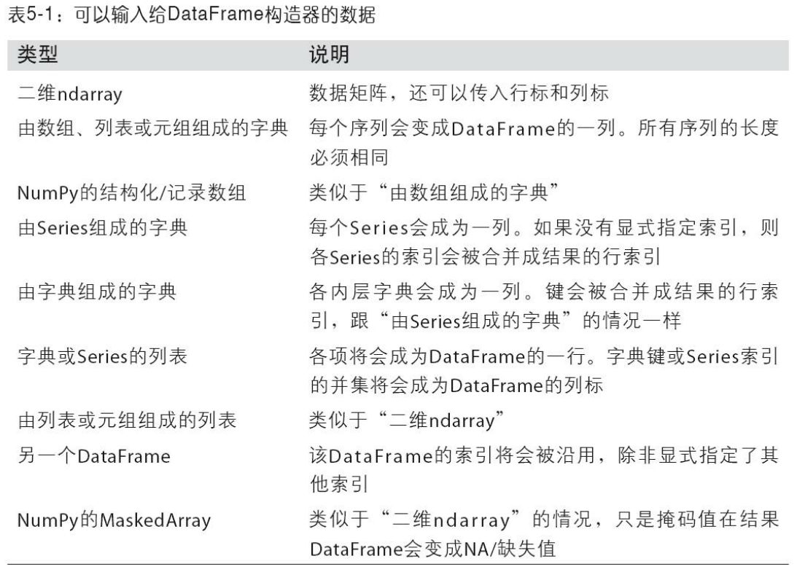
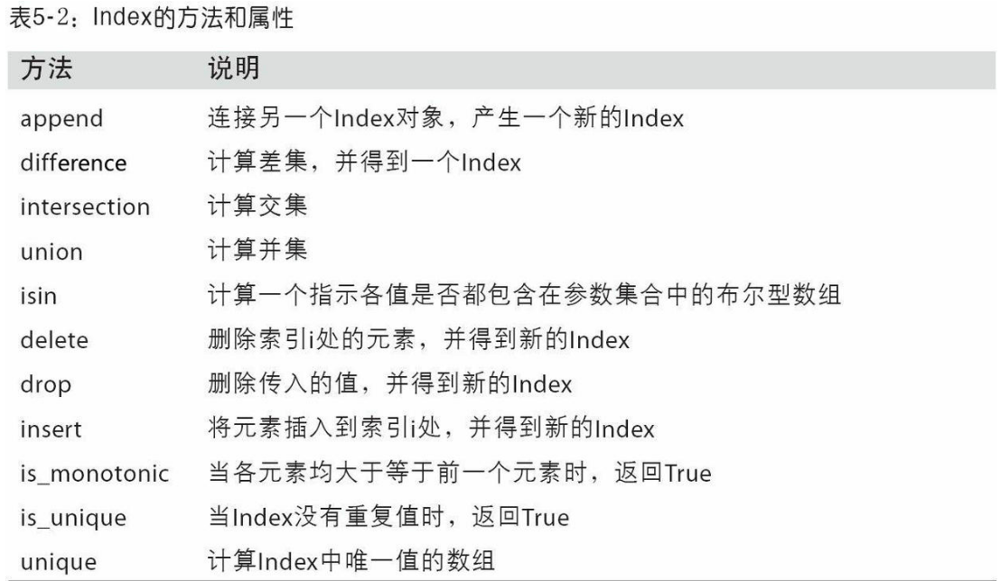
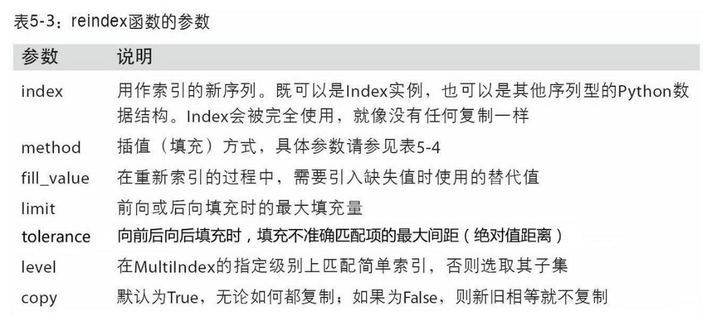

# pandas入门

pands含有使数据清洗和分析工作变得更快更简单的数据结构和操作工具。
pandas通常和其他工具一同使用，如数值计算工具Numpy和Scipy，分析库statsmodels和scikit-learn和数据可视化库matplotilb
pandas是基于Numpy数组构造的，特别是基于数组的函数和不使用for循环的数据处理

## pandas的数据结构介绍
要使用pandas，你首先就得熟悉它的两个主要数据结构：Series和DataFrame。

### Series
Series是一种类似于一维数组的对象，它由一组数据（各种Numpy数据类型）以及一组与之相关的数据标签（即索引）组成。仅由一组数据即可产生最简单的Series：

```python
In [11]: obj = pd.Series([4, 7, -5, 3])

In [12]: obj
Out[12]: 
0    4
1    7
2   -5
3    3
dtype: int64

```
可以通过Series的values和index属性获取其数组表示形式和索引对象：
```python
In [13]: obj.values
Out[13]: array([ 4,  7, -5,  3])
​
In [14]: obj.index  # like range(4)
Out[14]: RangeIndex(start=0, stop=4, step=1)
```
通常，我们希望所创建的Series带有一个可以对各个数据点进行标记的索引：
```python
In [15]: obj2 = pd.Series([4, 7, -5, 3], index=['d', 'b', 'a', 'c'])

In [16]: obj2
Out[16]: 
d    4
b    7
a   -5
c    3
dtype: int64

In [17]: obj2.index
Out[17]: Index(['d', 'b', 'a', 'c'], dtype='object')
```
与普通NumPy数组相比，你可以通过索引的方式选取Series中的单个或一组值：
```python
In [18]: obj2['a']
Out[18]: -5

In [19]: obj2['d'] = 6

In [20]: obj2[['c', 'a', 'd']]
Out[20]: 
c    3
a   -5
d    6
dtype: int64
```
['c', 'a', 'd']是索引列表，即使它包含的是字符串而不是整数。

使用NumPy函数或类似NumPy的运算（如根据布尔型数组进行过滤、标量乘法、应用数学函数等）都会保留索引值的链接：

```python
In [21]: obj2[obj2 > 0]
Out[21]: 
d    6
b    7
c    3
dtype: int64

In [22]: obj2 * 2
Out[22]:
d    12
b    14
a   -10
c     6
dtype: int64

In [23]: np.exp(obj2)
Out[23]: 
d     403.428793
b    1096.633158
a       0.006738
c      20.085537
dtype: float64
```
还可以将Series看成是一个定长的有序字典，因为它是索引值到数据值的一个映射。它可以用在许多原本需要字典的函数中：
```python
In [24]: 'b' in obj2
Out[24]: True

In [25]: 'e' in obj2
Out[25]: False
```
如果数据被存放在一个Python中，也可以直接通过这个字典来创建Series：
```python
In [26]: sdata = {'Ohio': 35000, 'Texas': 71000, 'Oregon': 16000, 'Utah': 5000}

In [27]: obj3 = pd.Series(sdata)

In [28]: obj3
Out[28]: 
Ohio      35000
Oregon    16000
Texas     71000
Utah       5000
dtype: int64
```
如果只传入一个字典，则结果Series中的索引就是原字典的键（有序排列）。你可以传入排好序的字典的键以改变顺序：
```python
In [29]: states = ['California', 'Ohio', 'Oregon', 'Texas']

In [30]: obj4 = pd.Series(sdata, index=states)

In [31]: obj4
Out[31]: 
California        NaN
Ohio          35000.0
Oregon        16000.0
Texas         71000.0
dtype: float64
```
在这个例子中，sdata中跟states索引相匹配的那3个值会被找出来并放到相应的位置上，但由于"California"所对应的sdata值找不到，所以其结果就为NaN（即“非数字”（not a number），在pandas中，它用于表示缺失或NA值）。因为‘Utah’不在states中，它被从结果中除去。


我们使用缺失(missing)或NA值表示缺失数据。pandas的isnull和notnull函数可用于检测缺失数据：
```python
In [32]: pd.isnull(obj4)
Out[32]: 
California     True
Ohio          False
Oregon        False
Texas         False
dtype: bool

In [33]: pd.notnull(obj4)
Out[33]: 
California    False
Ohio           True
Oregon         True
Texas          True
dtype: bool
```

Series也有类似的实例方法：
```python
In [34]: obj4.isnull()
Out[34]: 
California     True
Ohio          False
Oregon        False
Texas         False
dtype: bool
```

对于许多应用而言，Series最重要的一个功能是，它会根据运算的索引标签自动对齐数据：
```python
In [35]: obj3
Out[35]: 
Ohio      35000
Oregon    16000
Texas     71000
Utah       5000
dtype: int64

In [36]: obj4
Out[36]: 
California        NaN
Ohio          35000.0
Oregon        16000.0
Texas         71000.0
dtype: float64

In [37]: obj3 + obj4
Out[37]: 
California         NaN
Ohio           70000.0
Oregon         32000.0
Texas         142000.0
Utah               NaN
dtype: float64
```

Series对象本身以及其索引就有一个name属性，该属性pandas其他的关键功能关系非常密切：
```python
In [38]: obj4.name = 'population'

In [39]: obj4.index.name = 'state'

In [40]: obj4
Out[40]: 
state
California        NaN
Ohio          35000.0
Oregon        16000.0
Texas         71000.0
Name: population, dtype: float64

```

Series的索引可以通过赋值的方式就地修改：
```python
In [41]: obj
Out[41]: 
0    4
1    7
2   -5
3    3
dtype: int64

In [42]: obj.index = ['Bob', 'Steve', 'Jeff', 'Ryan']

In [43]: obj
Out[43]: 
Bob      4
Steve    7
Jeff    -5
Ryan     3
dtype: int64
```


### DataFrame
DataFrame是一个表格型的数据结构，它含有一组有序的列，每列可以使不同的值类型（数值、字符串、布尔值等）。DataFrame既有行索引也有列索引，它可以被看做是Series组成的字典（共用同一个索引）。DataFrame中的数据是以一个或多个二维块存放的（而不是列表、字典或别的一维数据结构）。

创建DataFrame的办法有很多，最常用的一种是直接传入一个由等长列表或Numpy数组组成的字典：

```python
data = {'state': ['Ohio', 'Ohio', 'Ohio', 'Nevada', 'Nevada', 'Nevada'],
        'year': [2000, 2001, 2002, 2001, 2002, 2003],
        'pop': [1.5, 1.7, 3.6, 2.4, 2.9, 3.2]}
frame = pd.DataFrame(data)
```
结果DataFrame会自动加上索引（跟Series一样），且全部列会被有序排列：
```python
In [45]: frame
Out[45]: 
   pop   state  year
0  1.5    Ohio  2000
1  1.7    Ohio  2001
2  3.6    Ohio  2002
3  2.4  Nevada  2001
4  2.9  Nevada  2002
5  3.2  Nevada  2003
```

对于特别大的DataFrame，head方法会选取前五行：
```python
In [46]: frame.head()
Out[46]: 
   pop   state  year
0  1.5    Ohio  2000
1  1.7    Ohio  2001
2  3.6    Ohio  2002
3  2.4  Nevada  2001
4  2.9  Nevada  2002
```

如果指定了序列列，则DataFrame的列就会按照指定顺序进行排列：
```python
In [47]: pd.DataFrame(data, columns=['year', 'state', 'pop'])
Out[47]: 
   year   state  pop
0  2000    Ohio  1.5
1  2001    Ohio  1.7
2  2002    Ohio  3.6
3  2001  Nevada  2.4
4  2002  Nevada  2.9
5  2003  Nevada  3.2
```

如果传入的列在数据中找不到，就会在结果中产生缺失值：
```python
In [48]: frame2 = pd.DataFrame(data, columns=['year', 'state', 'pop', 'debt'],
   ....:                       index=['one', 'two', 'three', 'four',
   ....:                              'five', 'six'])

In [49]: frame2
Out[49]: 
       year   state  pop debt
one    2000    Ohio  1.5  NaN
two    2001    Ohio  1.7  NaN
three  2002    Ohio  3.6  NaN
four   2001  Nevada  2.4  NaN
five   2002  Nevada  2.9  NaN
six    2003  Nevada  3.2  NaN

In [50]: frame2.columns
Out[50]: Index(['year', 'state', 'pop', 'debt'], dtype='object')
```

通过类似字典标记的方式或属性的方式，可以将DataFrame的列获取为一个Series：
```python
In [51]: frame2['state']
Out[51]: 
one        Ohio
two        Ohio
three      Ohio
four     Nevada
five     Nevada
six      Nevada
Name: state, dtype: object

In [52]: frame2.year
Out[52]: 
one      2000
two      2001
three    2002
four     2001
five     2002
six      2003
Name: year, dtype: int64
```

行也可以通过位置或名称的方式进行获取，比如loc属性
```python
In [53]: frame2.loc['three']
Out[53]: 
year     2002
state    Ohio
pop       3.6
debt      NaN
Name: three, dtype: object
```
列可以通过赋值的方式进行修改。例如，我们可以给那个空的“debt”列附上一个标量或一组值：
```python
In [54]: frame2['debt'] = 16.5

In [55]: frame2
Out[55]: 
       year   state  pop  debt
one    2000    Ohio  1.5  16.5
two    2001    Ohio  1.7  16.5
three  2002    Ohio  3.6  16.5
four   2001  Nevada  2.4  16.5
five   2002  Nevada  2.9  16.5
six    2003  Nevada  3.2  16.5

In [56]: frame2['debt'] = np.arange(6.)

In [57]: frame2
Out[57]: 
       year   state  pop  debt
one    2000    Ohio  1.5   0.0
two    2001    Ohio  1.7   1.0
three  2002    Ohio  3.6   2.0
four   2001  Nevada  2.4   3.0
five   2002  Nevada  2.9   4.0
six    2003  Nevada  3.2   5.0

```

将列表或数组赋值给某个列时，其长度必须跟DataFrame的长度匹配。如果赋值的是一个Series，就会精确匹配DataFrame的索引，所有的空位都将被填上缺失值：

```python
In [58]: val = pd.Series([-1.2, -1.5, -1.7], index=['two', 'four', 'five'])

In [59]: frame2['debt'] = val

In [60]: frame2
Out[60]: 
       year   state  pop  debt
one    2000    Ohio  1.5   NaN
two    2001    Ohio  1.7  -1.2
three  2002    Ohio  3.6   NaN
four   2001  Nevada  2.4  -1.5
five   2002  Nevada  2.9  -1.7
six    2003  Nevada  3.2   NaN
```

为不存在的列赋值会创建出一个新的列。关键字del用于删除列。

作为del的例子，我先添加一个新的布尔值的列，state是否为‘Ohio’：

```python
In [61]: frame2['eastern'] = frame2.state == 'Ohio'

In [62]: frame2
Out[62]: 
       year   state  pop  debt  eastern
one    2000    Ohio  1.5   NaN     True
two    2001    Ohio  1.7  -1.2     True
three  2002    Ohio  3.6   NaN     True
four   2001  Nevada  2.4  -1.5    False
five   2002  Nevada  2.9  -1.7    False
six    2003  Nevada  3.2   NaN    False
```
注意不能用frame2.eastern创建新的列。

del方法可以用来删除这列
```python
In [63]: del frame2['eastern']

In [64]: frame2.columns
Out[64]: Index(['year', 'state', 'pop', 'debt'], dtype='object')
```

注意：通过索引方式返回的列只是相应数据的视图而已，并不是副本。因此，对返回的Series所做的任何就地修改全部都会反映到源DataFrame。通过Series的copy方法即可指定复制列。

另一种常见的数据形式是嵌套字典：
```python
In [65]: pop = {'Nevada': {2001: 2.4, 2002: 2.9},
....:        'Ohio': {2000: 1.5, 2001: 1.7, 2002: 3.6}}
```

如果是嵌套字典传给DataFrame，pandas就会解释为：外层字典的键作为列，内层键作为行索引：

```python
In [66]: frame3 = pd.DataFrame(pop)

In [67]: frame3
Out[67]: 
      Nevada  Ohio
2000     NaN   1.5
2001     2.4   1.7
2002     2.9   3.6
```
也可以使用类似NUmPy数组的方法，对DataFrame进行转置（交换行和列）：
```python
In [68]: frame3.T
Out[68]: 
        2000  2001  2002
Nevada   NaN   2.4   2.9
Ohio     1.5   1.7   3.6
```
内层字典的键会被合并、排序以形成最终的索引。如果明确指定了索引，则不会这样：

```python
In [69]: pd.DataFrame(pop, index=[2001, 2002, 2003])
Out[69]: 
      Nevada  Ohio
2001     2.4   1.7
2002     2.9   3.6
2003     NaN   NaN
```

由Series组成的字典差不多也是一样的用法：
```python
In [70]: pdata = {'Ohio': frame3['Ohio'][:-1],
....:          'Nevada': frame3['Nevada'][:2]}

In [71]: pd.DataFrame(pdata)
Out[71]: 
      Nevada  Ohio
2000     NaN   1.5
2001     2.4   1.7
```



如果设置了DataFrame的index和columns的name属性，则这些信息也会被显示出来：
```python
In [72]: frame3.index.name = 'year'; frame3.columns.name = 'state'

In [73]: frame3
Out[73]: 
state  Nevada  Ohio
year
2000      NaN   1.5
2001      2.4   1.7
2002      2.9   3.6
```
跟Series一样，values属性也会以二维ndarray的形式返回DataFrame中的数据：
```python

In [74]: frame3.values
Out[74]: 
array([[ nan,  1.5],
       [ 2.4,  1.7],
       [ 2.9,  3.6]])
```
如果DataFrame各列的数据类型不同，则值数组的dtype就会选用能兼容所有列的数据类型：
```python
In [75]: frame2.values
Out[75]:
array([[2000, 'Ohio', 1.5, nan],
       [2001, 'Ohio', 1.7, -1.2],
       [2002, 'Ohio', 3.6, nan],
       [2001, 'Nevada', 2.4, -1.5],
       [2002, 'Nevada', 2.9, -1.7],
       [2003, 'Nevada', 3.2, nan]], dtype=object)
```

### 索引对象
pandas的索引对象负责管理轴标签和其他元数据（比如轴名称等）。构建Series或DataFrame时，所用到的任何数组或其他序列的标签都会被转化成一个index：
```python
In [76]: obj = pd.Series(range(3), index=['a', 'b', 'c'])

In [77]: index = obj.index

In [78]: index
Out[78]: Index(['a', 'b', 'c'], dtype='object')

In [79]: index[1:]
Out[79]: Index(['b', 'c'], dtype='object')
```

index对象是不可变的，因此用户不能对其进行修改：
```python
index[1] = 'd'  # TypeError
```

不可变可以使Index对象在多个数据结构之间安全共享：
```python
In [80]: labels = pd.Index(np.arange(3))

In [81]: labels
Out[81]: Int64Index([0, 1, 2], dtype='int64')

In [82]: obj2 = pd.Series([1.5, -2.5, 0], index=labels)

In [83]: obj2
Out[83]: 
0    1.5
1   -2.5
2    0.0
dtype: float64

In [84]: obj2.index is labels
Out[84]: True
```

注意：虽然用户不需要经常使用index功能功能，但是因为一些操作会生成包含被索引话的数据，理解它们的工作原理是很重要的。

除了类似于数组，index的功能也类似一个固定大小的集合：
```python
In [85]: frame3
Out[85]: 
state  Nevada  Ohio
year               
2000      NaN   1.5
2001      2.4   1.7
2002      2.9   3.6
In [86]: frame3.columns
Out[86]: Index(['Nevada', 'Ohio'], dtype='object', name='state')

In [87]: 'Ohio' in frame3.columns
Out[87]: True

In [88]: 2003 in frame3.index
Out[88]: False
```
与python的集合不同，pandas的Index可以包含重复的标签：
```python
In [89]: dup_labels = pd.Index(['foo', 'foo', 'bar', 'bar'])

In [90]: dup_labels
Out[90]: Index(['foo', 'foo', 'bar', 'bar'], dtype='object')
```

选择重复的标签，会显示所有的结果。



## 基本功能
### 重新索引
pandas对象的一个重要方法是reindex，其作用是创建一个新的对象，它的数据符合新的索引。
```python
In [91]: obj = pd.Series([4.5, 7.2, -5.3, 3.6], index=['d', 'b', 'a', 'c'])

In [92]: obj
Out[92]: 
d    4.5
b    7.2
a   -5.3
c    3.6
dtype: float64
```
用Series的reindex将会根据新索引进行重排。如果某个索引值当前不存在，就引入缺失值：
```python
In [93]: obj2 = obj.reindex(['a', 'b', 'c', 'd', 'e'])

In [94]: obj2
Out[94]: 
a   -5.3
b    7.2
c    3.6
d    4.5
e    NaN
dtype: float64
```
对于时间序列这样的有序数据，重新索引时可能需要做一些插值处理。method选项即可达到此目的，例如，使用ffill可以实现前向值填充：
```python
In [95]: obj3 = pd.Series(['blue', 'purple', 'yellow'], index=[0, 2, 4])

In [96]: obj3
Out[96]: 
0      blue
2    purple
4    yellow
dtype: object

In [97]: obj3.reindex(range(6), method='ffill')
Out[97]: 
0      blue
1      blue
2    purple
3    purple
4    yellow
5    yellow
dtype: object
```
借助DataFrame，reindex可以修改（行）索引和列。只传递一个序列时，会重新索引结果的行：
```python
In [98]: frame = pd.DataFrame(np.arange(9).reshape((3, 3)),
   ....:                      index=['a', 'c', 'd'],
   ....:                      columns=['Ohio', 'Texas', 'California'])

In [99]: frame
Out[99]: 
   Ohio  Texas  California
a     0      1           2
c     3      4           5
d     6      7           8

In [100]: frame2 = frame.reindex(['a', 'b', 'c', 'd'])

In [101]: frame2
Out[101]: 
   Ohio  Texas  California
a   0.0    1.0         2.0
b   NaN    NaN         NaN
c   3.0    4.0         5.0
d   6.0    7.0         8.0
```

列可以用columns关键字重新索引：

```python
In [102]: states = ['Texas', 'Utah', 'California']

In [103]: frame.reindex(columns=states)
Out[103]: 
   Texas  Utah  California
a      1   NaN           2
c      4   NaN           5
d      7   NaN           8
```



### 丢弃指定轴上的项

丢弃某条轴上的一个或多个项很简单，只要有一个索引数组或列表即可。由于需要执行一些数据整理和集合逻辑，所以drop方法返回的是一个在指定轴上删除了指定值的新对象。
```python

In [105]: obj = pd.Series(np.arange(5.), index=['a', 'b', 'c', 'd', 'e'])

In [106]: obj
Out[106]: 
a    0.0
b    1.0
c    2.0
d    3.0
e    4.0
dtype: float64

In [107]: new_obj = obj.drop('c')

In [108]: new_obj
Out[108]: 
a    0.0
b    1.0
d    3.0
e    4.0
dtype: float64

In [109]: obj.drop(['d', 'c'])
Out[109]: 
a    0.0
b    1.0
e    4.0
dtype: float64

```
对于DataFrame，可以删除任意轴上的索引值，为了演示，先新建一个DataFrame的例子
```python
In [110]: data = pd.DataFrame(np.arange(16).reshape((4, 4)),
   .....:                     index=['Ohio', 'Colorado', 'Utah', 'New York'],
   .....:                     columns=['one', 'two', 'three', 'four'])

In [111]: data
Out[111]: 
          one  two  three  four
Ohio        0    1      2     3
Colorado    4    5      6     7
Utah        8    9     10    11
New York   12   13     14    15
```
用标签序列调用drop会从行标签（axis 0 ）删除

```python
In [112]: data.drop(['Colorado', 'Ohio'])
Out[112]: 
          one  two  three  four
Utah        8    9     10    11
New York   12   13     14    15

```
通过传递axis=1或axis='columns'可以删除列的值：
```python
In [113]: data.drop('two', axis=1)
Out[113]: 
          one  three  four
Ohio        0      2     3
Colorado    4      6     7
Utah        8     10    11
New York   12     14    15

In [114]: data.drop(['two', 'four'], axis='columns')
Out[114]: 
          one  three
Ohio        0      2
Colorado    4      6
Utah        8     10
New York   12     14

```

许多函数，如drop，会修改Series或DataFrame的大小或形状，可以就地修改对象，不会返回新的对象：
```python
In [115]: obj.drop('c', inplace=True)

In [116]: obj
Out[116]: 
a    0.0
b    1.0
d    3.0
e    4.0
dtype: float64
```
小心使用inplace，它会销毁所有被删除的数据。


### 索引、选取和过滤


Series索引（obj[...]）的工作方式类似于NumPy数组的索引，只不过Series的索引值不只是整数。下面是几个例子：

```python
In [117]: obj = pd.Series(np.arange(4.), index=['a', 'b', 'c', 'd'])

In [118]: obj
Out[118]: 
a    0.0
b    1.0
c    2.0
d    3.0
dtype: float64

In [119]: obj['b']
Out[119]: 1.0

In [120]: obj[1]
Out[120]: 1.0

In [121]: obj[2:4]
Out[121]: 
c    2.0
d    3.0
dtype: float64

In [122]: obj[['b', 'a', 'd']]
Out[122]:
b    1.0
a    0.0
d    3.0
dtype: float64

In [123]: obj[[1, 3]]
Out[123]: 
b    1.0
d    3.0
dtype: float64

In [124]: obj[obj < 2]
Out[124]: 
a    0.0
b    1.0
dtype: float64
```

利用标签的切片运算与普通的python切片运算不同，其末端是包含的：
```python
In [125]: obj['b':'c']
Out[125]:
b    1.0
c    2.0
dtype: float64
```


### 使用loc和iloc进行选取

对于DataFrame的行的标签索引，我引入了特殊的标签运算符loc和iloc。他们可以让你用类似Numpy的标记，使用轴标签（loc）或整数索引（iloc），从DataFrame选择列和行的子集。

作为一个初步示例，让我们通过标签选择一行或多列：
```python
In [137]: data.loc['Colorado', ['two', 'three']]
Out[137]: 
two      5
three    6
Name: Colorado, dtype: int64
```
