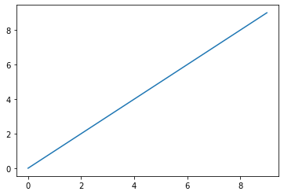
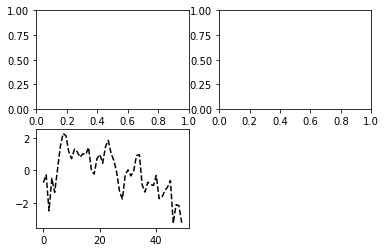
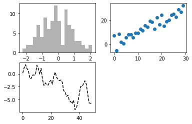
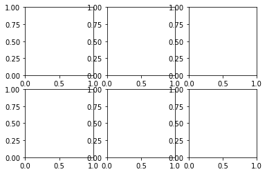
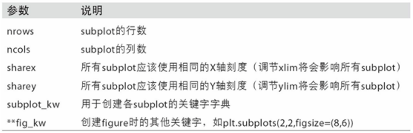

# 绘图和可视化

matplotlib是一个用于创建出版质量图表的桌面绘图包（主要是2D方面）

matplotlib和IPython社区进行合作，简化了从IPython shell（包括现在的Jupyter notebook）进行交互式绘图。matplotlib支持各种操作系统上许多不同的GUI后端，而且还能将图片导出为各种常见的矢量（vector）和光栅（raster）图：PDF、SVG、JPG、PNG、BMP、GIF等。除了几张，本书中的大部分图都是用它生成的。

随着时间的发展，matplotlib衍生出了多个数据可视化的工具集，它们使用matplotlib作为底层。其中之一是seaborn

## matplotlib API入门

matplotlib的通常引入约定是
`import matplotlib.pyplot as plt`

```python
In [12]: import numpy as np

In [13]: data = np.arange(10)

In [14]: data
Out[14]: array([0, 1, 2, 3, 4, 5, 6, 7, 8, 9])

In [15]: plt.plot(data)

```


虽然seaborn这样的库和pandas的内置绘图函数能够处理许多普通的绘图任务，但是如果需要定义一些高级功能的话就必须学习 matplotlib API。

### Figure 和 Subplot
matplotlib 的图像都位于Figure对象中。你可以用plt.figure创建一个新的Figure：

`In [16]: fig = plt.figure()`


不能通过空Figure绘图。必须用add_subplot创建一个或多个subplot才行
```python
fig = plt.figure()
ax1 = fig.add_subplot(2, 2, 1)
ax2 = fig.add_subplot(2, 2, 2)
ax3 = fig.add_subplot(2, 2, 3)
```


如果这时执行一条绘图命令（如plt.plot([1.5, 3.5, -2, 1.6])），matplotlib就会在最后一个用过的subplot（如果没有则创建一个）上进行绘制，隐藏创建figure和subplot的过程。因此，如果我们执行下列命令

```python
fig = plt.figure()
ax1 = fig.add_subplot(2, 2, 1)
ax2 = fig.add_subplot(2, 2, 2)
ax3 = fig.add_subplot(2, 2, 3)
plt.plot(np.random.randn(50).cumsum(), 'k--')

```

"k--"是一个线型选项，用于告诉matplotlib绘制黑色虚线图。上面那些由fig.add_subplot所返回的对象是AxesSubplot对象，直接调用它们的实例方法就可以在其它空着的格子里面画图了

```python
fig = plt.figure()
ax1 = fig.add_subplot(2, 2, 1)
ax2 = fig.add_subplot(2, 2, 2)
ax3 = fig.add_subplot(2, 2, 3)
plt.plot(np.random.randn(50).cumsum(), 'k--')
ax1.hist(np.random.randn(100), bins=20, color='k', alpha=0.3)
ax2.scatter(np.arange(30), np.arange(30) + 3 * np.random.randn(30))
```


你可以在matplotlib的文档中找到各种图表类型。

创建包含 subplot 网格的 figure 是一个非常常见的任务， matplotlib有一个更为方便的方法 plt.subplots，它可以创建一个新的Figure，并返回一个含有已创建的 subplot 对象的 NumPy 数组：

`fig,axes = plt.subplots(2,3)`


`axes`

```
array([[<matplotlib.axes._subplots.AxesSubplot object at 0x7f61b358d630>,
        <matplotlib.axes._subplots.AxesSubplot object at 0x7f61b1b852b0>,
        <matplotlib.axes._subplots.AxesSubplot object at 0x7f61b1b34860>],
       [<matplotlib.axes._subplots.AxesSubplot object at 0x7f61b1ae4e10>,
        <matplotlib.axes._subplots.AxesSubplot object at 0x7f61b1aa2400>,
        <matplotlib.axes._subplots.AxesSubplot object at 0x7f61b1ad39b0>]],
      dtype=object)
```  

这是一个非常实用的，因为可以轻松的对axes数组进行索引，就好像是一个二维数组一样，例如axes[0,1].你还可以通过sharex和sharey指定subplot应该具有相同的X轴或Y轴。在比较相同范围的数据时，这也是非常实用的，否则，matplotlib会自动缩放各图表的界限

有关该方法的更多信息,如下图：



### 调整 subplot周围的间距

默认情况下，matplotlib会在subplot外围留下一定的边距，并在 subplot 之间留下一定的间距。间距跟图像的高度和宽度有关，因此，如果你调整了图像大小，间距也会自动调整。利用Figure的subplots_adjust方法可以轻而易举地修改间距，此外，它也是个顶级函数：

