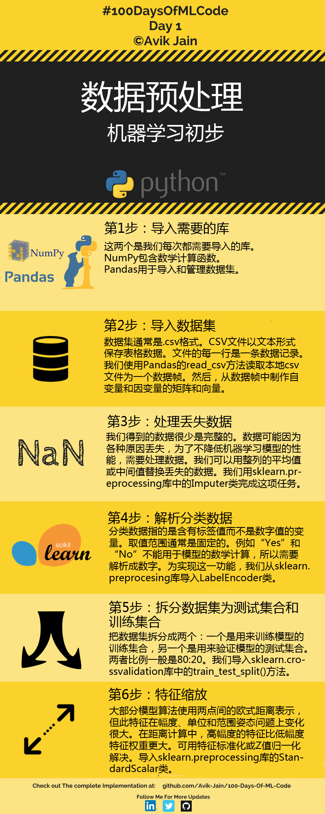

# 数据预处理





## 第1步:导入库
```python
import numpy as np
import pandas as pd
```

## 第2步:导入数据集
```python
dataset = pd.read_csv('Data.csv')
X = dataset.iloc[:,:-1].values  //.iloc[行,列]
Y = dataset.iloc[:,3].values   //全部行,和第三列
```

## 第3步:处理丢失数据
```python
from sklearn.impute import SimpleImputer

imputer = SimpleImputer(np.nan,"mean")
imputer = imputer.fit_transform(X[:,1:3])
X[:,1:3] = imputer
```

## 第4步:解析分类数据
```python
from sklearn.preprocessing import LabelEncoder,OneHotEncoder
labelencoder_X = LabelEncoder()
X[:,0] = labelencoder_X.fit_transform(x[:,0])
```

## 第5步:拆分数据集为训练集合和测试集合

```python
from sklearn.model_selection import train_test_split
X_train,X_test,Y_train,Y_test = train_test_split(X,Y,test_size=0.2,random_state = 0)
```


## 第6步:特征量化
```python
from sklearn.preprocessing import StandardScaler
sc_X = StandardScaler()
x_train = sc_X.fit_transform(X_train)
X_test = sc_X.transform(X_test)
```


