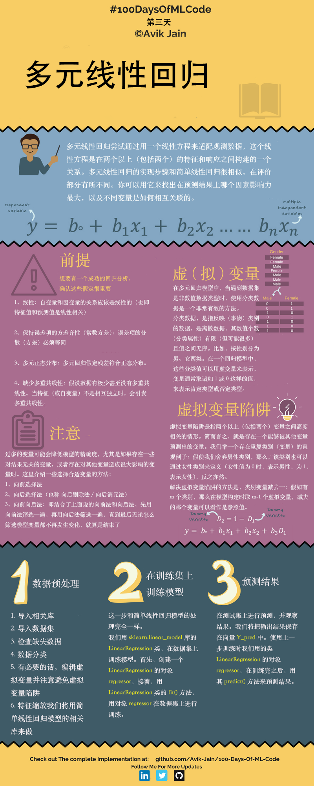

# day03 多元线性回归


## 第一步：数据预处理
###导入库
```python
import numpy as np
import pandas as pd
```

### 导入数据集
```python
dataset = pd.read_csv('data/50_Startups.csv')
X = dataset.iloc[:,:-1].values
Y = dataset.iloc[:,4].values
```

### 将类别数据数字化
```python
from skleran.preprocessing import LabelEncoder,OneHotEncoder
labelencoder = LabelEncoder()
X[:,3] =labelencoder.fit_transfrom(X[:,3])
onehotencoder = OneHotEncoder(categorical_features = [3])
X = onehotencoder.fit_transfrom(X).toarray()
```

### 躲避虚拟变量陷阱
```python
Ｘ　＝　Ｘ[:,1:]
```


### 拆分数据集为训练集和测试集
```python
from sklearn.model_selection import train_test_split
X_train, X_test, Y_train, Y_test = train_test_split(X, Y, test_size = 0.2, random_state = 0)
```
## 第２步：在训练集上训练多元线性回归模型
```python
from sklearn .linear_model import LinerRegression
regressor = LinearRegression()
regressor.fix(X_train,Y_train)
```

## 第３步：在测试集上预测结果
```python
y_pred = regressor.predict(X_test)
```


