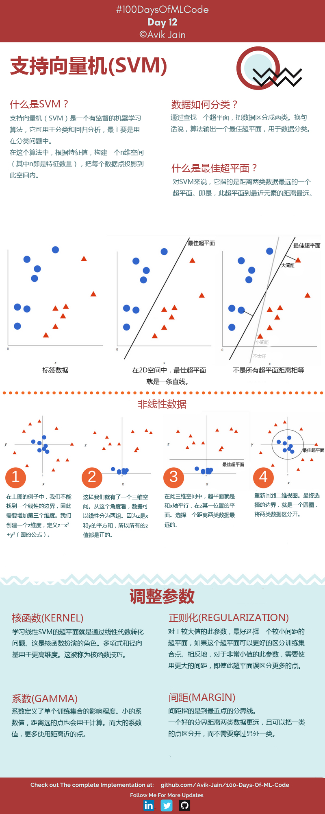

# day13 支持向量机




```python
import numpy as np
import matplotlib.pyplot as plt
import pandas as pd

dataset = pd.read_csv("data/Social_NetWork_Ads.csv")
x = dataset.iloc[:, [2, 3]].values
y = dataset.iloc[:, 4].values

```
# 拆分数据集为训练集和测试集
```python
from sklearn.model_selection import train_test_split

x_train, x_test, y_train, y_test = train_test_split(x, y, test_size=0.25, random_state=0)
```
# 特征量化

```python
from sklearn.preprocessing import StandardScaler

sc = StandardScaler()
x_train = sc.fit_transform(x_train)
x_test = sc.fit_transform(x_test)

```

# 适配SVM到训练集合

```python
from sklearn.svm import SVC

classifier = SVC(kernel='linear', random_state=0)
classifier.fit(x_train, y_train)
```
# 预测测试集结果
```python
y_pred = classifier.predict(x_test)
```

# 创建混淆矩阵
```python
from sklearn.metrics import confusion_matrix

cm = confusion_matrix(y_test, y_pred)
```

# 训练集可视化

```python
from matplotlib.colors import ListedColormap

x_set, y_set = x_train, y_train
x1, x2 = np.meshgrid(np.arange(start=x_set[:, 0].min() - 1, stop=x_set[:, 0].max() + 1, step=0.01),
                     np.arange(start=x_set[:, 1].min() - 1, stop=x_set[:, 1].max() + 1, step=0.01))

plt.contourf(x1, x2, classifier.predict(np.array([x1.ravel(), x2.ravel()]).T).reshape(x1.shape),
             alpha=0.75, cmap=ListedColormap(("red", "green")))
plt.xlim(x1.min(), x1.max())
plt.ylim(x2.min(), x2.max())

for i, j in enumerate(np.unique(y_set)):
    plt.scatter(x_set[y_set == j, 0], x_set[y_set == j, 1],
                c=ListedColormap(("red", "green"))(i), label=j)
plt.title("SVM (Training set)")
plt.xlabel("Age")
plt.ylabel("Estimated Salary")
plt.legend()
plt.show()
```
# 测试集结果可视化

```python
from matplotlib.colors import ListedColormap

x_set, y_set = x_test, y_test

x1, x2 = np.meshgrid(np.arange(start=x_set[:, 0].min() - 1, stop=x_set[:, 0].max() + 1, step=0.01),
                     np.arange(start=x_set[:, 1].min() - 1, stop=x_set[:, 1].max() + 1, step=0.01))

plt.contourf(x1,x2,classifier.predict(np.array([x1.ravel(),x2.ravel()]).T).reshape(x1.shape),
             alpha =0.75,cmap=ListedColormap(("red","green")))

plt.xlim(x1.min(),x1.max())
plt.ylim(x2.min(),x2.max())
for i,j in enumerate(np.unique(y_set)):
    plt.scatter(x_set[y_set ==j,0],x_set[y_set == j,1],
                c = ListedColormap(("red","green"))(i),label=j)

plt.title("SVM (Test set)")
plt.xlabel("Age")
plt.ylabel("Estimate Salary")
plt.legend()
plt.show()
```