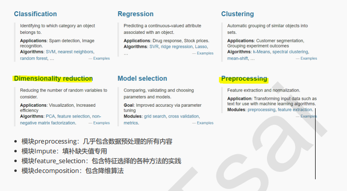
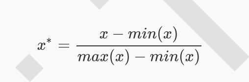
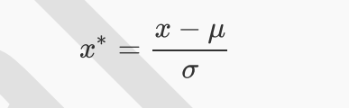

# sklearn中的数据预处理和特征工程

## 概述

### 数据预处理与特征工程

数据不给力,再高级的算法都没有用

**数据挖掘的五大流程**

- 1.获取数据
- 2.**数据预处理**
数据预处理是从数据中检测,纠正或删除损坏,不准确或不适用于模型的记录的过程
可能面对的问题有:数据类型不同,比如有的是文字,有的是数字,有的含时间序列,有的连续,有的间断
也可能数据的质量不行,有噪声,有异常,有缺失,数据出错,量纲不一,有重复,数据是偏态,数据量太大或太小
数据预处理的目的:让数据适应模型,匹配模型的需求

- 3.**特征工程**
特征工程是将原始数据转换为更能代表预测模型的潜在的问题的特征的过程,可以通过挑选最相关的特征,提取特征以及创造特征来实现.其中创建特征又经常以降维算法的方式实现,
可能面对的问题有:特征之间的相关性,特征和标签无关,特征太多或太小,或者干脆就无法表现出应该有的数据现象或无法展示数据的真实面貌.
特征工程的目的:1)降低计算成本   2)提升模型上限

- 4.建模,测试模型并预测出结果

- 5.上线,验证模型效果

### sklearn中的数据预处理和特征工程
sklearn中六大板块中有两块都是关于数据预处理和特征工程的,两个板块互相交互,为建模之前的全部工程打下基础.




## 数据预处理 Preprocessing & Impute

### 数据无量纲化


在机器学习算法实践中,我们往往有着将不同规格的数据转换到同一规格,或不同分布的数据转换到某个特定分布的需求,在中需求统称为将数据"无量纲化".

数据的无量纲化可以是线性的,也可以是非线性的.线性的无量纲化包括**中心化(Zero-centered或者Mean-subtraction)**处理和**缩放处理**(Scale).中心化的本质是让所有记录减去一个固定的值,即让数据样本数据平均到某个位置.缩放的本质是通过除以一个固定值,将数据固定在某个范围之中,取对数也算是一种缩放处理.

- **preprocessing.MinMaxScaler**
当数据(x)按照最小值中心化后,再按极差(最大值,最小值)缩放,数据移动了最小值个单位,并且会被收敛到[0,1]之间,而这个过程,就叫做**数据归一化**(Normalization,又称Min-Max-Scaling),归一化后数据服从正态分布,公式如下:




在sklearn中,我们使用`preprocessing.MinMaxScaler`来实现这个功能. MixMaxScaler有一个重要参数,feature_range,控制我们希望把数据压缩到的范围,默认是[0,1]

```python
import pandas as pd
from sklearn.preprocessing import MinMaxScaler

data = [[-1,2],[-0.5,6],[0,10],[1,18]]

# 实现归一化
scaler = MinMaxScaler()
scaler = scaler.fit(data)       #fit ,在这里的本质是生成min(x)和max(x)
result = scaler.transform(data)  #通过接口导出结果

print(result)

result_ = scaler.fit_transform(data) #训练和导出结果一步达成

print(result_)

scaler.inverse_transform(result)  # 将归一化的结果逆转

# 使用MinMaxScaler的参数Feature_range实现将数据归一化到[0,1]以外的范围中

data = [[-1,2],[-0.5,6],[0,10],[1,18]]
scaler = MinMaxScaler(feature_range=[5,10])
print(scaler)
result = scaler.fit_transform(data)
print(result)


# 使用numpy来实现归一化

import numpy as np
X = np.array([[-1,2],[-0.5,6],[0,10],[1,18]])

# 归一化
X_nor = (X-X.min(axis=0))/(X.max(axis=0)-X.min(axis=0))
print(X_nor)

# 逆转归一化
X_returned = X_nor*(X.max(axis=0)-X.min(axis=0))+X.min(axis=0)
print(X_returned)


```

**preprocessing.StandardScaler**
当数据(x)按均值去中心化后,再按标准差缩放,数据就会服从均值为0,方差为1的正态分布(即标准正态分布),而这个过程,就叫做**数据标准化**(Standardization,又称Z-score normalization),公式如下:


