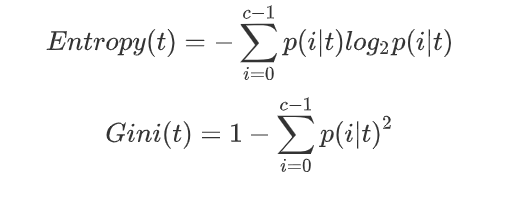

# 决策树


## 概述

### 决策树是如何工作的
在决策过程中,我们一直对在记录的特征进行提问.最初的问题所在的地方叫做`根节点`,在得到结论前的每一个问题都是`中间节点`,而得到的每一个结论都叫做`叶子节点`

```
挂念概念:
根节点:没有进边,有出边.包含最初的,针对特征的提问
中间节点:既有进边也有出边,进边只有一条,出边可以有很多条.都是针对特征的提问
叶子节点:有进边,没有出边,每个 叶子节点都是一个类别标签
叶子节点和父节点:在两个相连的节点中,跟接近根节点的是父节点,另一个是子节点

```


```
决策树算法的核心是要解决两个问题: 
- 如何从数据表中找出最佳节点和最佳分支?
- 如何让决策树停止生长,防止过拟合?
```

### sklearn中的决策树

- 模块 sklearn.tree

sklearn中决策树的类都是在"tree"这个模块之下.这个模块总共包含五个类:
|   tree.DecisionTreeClassifier  | 分类树    |
| --- | --- |
|  tree.DecisionTreeRegressor   | 回归树    |
|  tree.export_graphviz   |   将生成的决策树导出为DOT格式,画图专用  |
|  tree.ExtraTreeClassifier   |  高随机版本的分类树   |
|    tree.ExtraTreeRegressor | 高随机版本的回归数    |

主要讲解分类树和回归数

- sklearn的基本建模流程

我们先来了解一下sklearn建模的基本流程


这个分类树流程对应代码如下
```python
from sklearn import tree

clf = tree.DecisionTreeClassifier()  #实例化
clf = clf.fit(x_train,y_train)       #用训练集数据训练模型
result = clf.score(x_test,y_test)    #导入测试集,从接口中调用需要的信息


```

## DecisionTreeClassifier

### 重要参数

- criterion

为了要将表格转化为一棵树,决策树需要找出最佳节点和最佳的分枝方法,对于分类来说,衡量这个"最佳"的指标叫做 "不纯度" ,通常来说,不纯度越低,决策树对训练集的拟合越好.
现在使用的决策树算法在分枝方法上的核心大多是围绕在对某个不纯度相关指标的最优化上.


不纯度基于节点来计算,树中的每一个节点都会有一个不纯度,并且子节点的不纯度一定是低于父节点的,也就是说,在同一颗决策树上,叶子节点的不纯度一定是最低的.

`Criterion` 这个参数正是用来决定不纯度的计算方法.sklearn提供了两种选择:
1) 输入"entropy",使用`信息熵(Entropy)`
2) 输入 "gini",使用`基尼系数(Gini Impurity)`



当使用信息熵时,sklearn实际上计算的是对基于信息熵的信息增益(Information Gain),即父节点的信息熵和子节点的信息熵之差

 比起基尼系数,信息熵对不纯度更加敏感,对不纯度的惩罚最强.但是`在实际使用中,信息熵和基尼系数的效果基本相同`

|      参数      |                                                                     criterion                                                                     |
| -------------- | ------------------------------------------------------------------------------------------------------------------------------------------------ |
| 如何影响模型?    | 确定不纯度的计算方法,帮忙找出最佳节点和最佳分支,不纯度越低,决策树对训练集的拟合越好                                                                               |
| 可能的输入有哪些? | 不填默认基尼系数,填写gini使用基尼系数,填写entropy使用信息                                                                                                  |
| 怎样选取参数?     | 通常就是基尼系数    数据维度很大,噪音很大时使用基尼系数    维度低,数据比较清晰的时候,信息熵和基尼系数没有区别    当决策树的拟合程度不够的时,使用信息熵    两个都试试,不好就换另外一个 |


到这里,决策树的基本流程其实可以简单概括如下:

- 1 计算全部特征的不纯度指标
- 2 选取不纯度指标最优的特征来分枝
- 3 在第一个特征的分枝下,计算全部特征的不纯度指标
- 4 选取不纯度指标最优的特征继续分枝

直到没有更多的特征可用,或整体的不纯度指标已经最优,决策树就会停止生长.

- 建立一棵树

1. 导入需要的算法和模块

```python
from sklearn import tree
from sklearn.datasets import load_win
from sklearn.model_selection import train_test_split
```
2. 探索数据

```python
wine = load_wine()
wine.data.shape
wine.target

# 如果wine是一张表,应该长这样
import pandas as pd
pd.concat([pd.DataFrame(wine.data),pd.DataFrame(wine.target)],axis=1)

wine.feature_names
wine.target_names
```


3. 分训练集和测试集

```python
x_train,x_test,y_train,y_test = train_test_split(wine.data,wine.target,test_size=0.3)

x_train.shape
x_test.shape
```


4. 建立模型

```python
clf = tree.DecisionTreeClassifier(criterion="entropy")
clf.fit(x_train,y_train)
score = clf.score(x_test,y_test)  # 返回预测的准确度

score
```

5. 画出一棵树

```python
feature_name = ["酒精","苹果酸","灰","灰的碱性","镁","总酚","类黄酮","非黄烷类酚类","花青素","颜色强度","色调","od280/od315稀释葡萄酒","脯氨酸"]

import graphviz

dot_data = tree.export_graphviz(
                            clf,
                            class_names = ["琴酒","雪莉","贝尔摩德"],
                            filled = True,
                            rounded = True,
                            
)

graph = graphviz.Source(dot_data)
graph

```

6. 探索决策树

```python
# 特征重要性
clf.feature_importances_

[*zip(feature_name,clf.feature_importances_)]


```


无论决策树模型如何进行优化,在分枝上的本质还是在追求某个不纯度相关的指标的优化,而正如我们提到的,不纯度是基于节点来计算的,也就是说说,决策树在建树时,是靠优化节点来追求一棵优化的树,但最优的节点能够保证最优的树吗?集成算法用来解决这个问题:sklearn表示,既然一棵树不能保证最优,那就建更多不同的树,然后从中取最好的.

怎样从一组数据集中建不同的树?在每次分枝时,不从使用全部特征,而是随机选取部分特征,从选取不纯度相关指标最优的作为分枝用的节点.这样,每次生成的树也就不同了.

```python
clf = tree.DecisionTreeClassifier(criterion="entropy",random_state=30)
clf = clf.fit(x_train,y_train)
score = clf.score(x_test,y_test)  # 返回预测的准确度
score
```

### random_state & splitter

random_state用来设置分枝中的随机模式的参数,默认None,在高纬度时随机性会表现更明显,低维度的数据(比如鸢尾花数据集),随机性几乎不会显现.输入任意整数,会一直长出同一棵树,让模型稳定下来.

splitter也是用来控制决策树中的随机选项的,有两种输入值,输入`"best"`,决策树在分枝时虽然是随机的,但是还是会优先选择更加重要的特征进行分枝(重要性可以通过`feature_importances_`查看),输入`"random"`,决策树在分枝时会更加随机,树会因为含有更过的不必要信息而更深更大,并因这些不必要信息而降低对训练集的拟合.
这也是防止过拟合的一种方式.

当你预测到你的模型会过拟合,用这两个参数来帮助你降低树建成之后过拟合的可能性.当然,树一旦建成,我们依然是使用剪枝参数来防止过拟合.

```python
clf = tree.DecisionTreeClassifier(criterion="entropy",
                                  random_state = 30,
                                  splitter = "random",
                                  )

clf = clf.fit(x_train,y_train)
score = clf.score(x_test,y_test)
score

import graphviz

dot_data = tree.export_graphviz(
                                clf,
                                feature_names = feature_name,
                                class_names = ["琴酒","雪莉","贝尔摩德"],
                                filled = True,
                                rounded = True,
                                )
graph = graphviz.Source(dot_data)
graph
```

### 剪枝参数

在不加限制的情况,一棵决策树会生长到衡量不纯度的指标最优,或者没有更多的特征可用为止.这样的决策树往往会过拟合,这就是说`它会在训练集上表现很好,在测试集上却表现糟糕`.


```python
# 我们的树对训练集合的拟合程度如何?
score_train = clf.score(x_train,y_train)
score_train
```

为了让决策树有更好的泛化性,我们要对决策苏进行剪枝.`剪枝策略对决策树的影响巨大,正确的剪枝策略是优化决策树算法的核心`.sklearn为我们提供了不同的剪枝策略:

- max_depth
限制树的最大深度,超过设定深度的树枝全部剪掉(建议从=3开始尝试)

- min_samples_leaf & min_samples_split
`min_samples_leaf`限定,一个节点在分枝后的每个子节点都必须包含至少`min_samples_leaf`个训练样本,否则分枝就不会发生,或者,分枝会朝满足每个子节点都包含 `min_samples_leaf` 个样本的方向去发生
一般搭配`max_depth`使用,在回归树中有神奇的效果,可以让模型变得更加平滑.这个参数的数量设置的太小会引发过拟合,设置的太大就会阻止模型学习数据.
一般来说,建议从=5开始使用.

`min_samples_split`限定,一个节点必须要包含至少`min_samples_split`个训练样本,这个节点才允许被分枝,否则分枝就不会发生.


```python
clf = tree.DecisionTreeClassifier(criterion="entropy",
                                 random_state = 30,
                                 splitter = "random",
                                 max_depth = 3,
                                 min_samples_leaf = 10,
                                 min_samples_split = 10,
                                 )
clf = clf.fit(x_train,y_train)

dot_data = tree.export_graphviz(clf,
                                feature_names = feature_name,
                                class_names = ["琴酒","雪莉","贝尔摩德"],
                                filled = True,
                                rounded = True
                                )
graph = graphviz.Source(dot_data)

graph

clf.score(x_train,y_train)
clf.score(x_test,y_test)

```


- max_features & min_impurity_decrease

一般`max_depth`使用,用作树的"精修"

max_features 限制分枝时考虑的特征个数,超过限制个数的特征都会被舍弃.和`max_depth`异曲同工,
max_features 是用来限制高纬度数据过拟合的剪枝参数,其方法比较暴力,是直接限制可以使用的特征数量而强行使决策树停下的参数,在不知道决策树中各个特征的重要性情况下,强行设置这个参数可能会导致模型学习不足.如果希望通过降维的方式防止过拟合,建议使用 PCA ,ICA或者特征选择模块中的降维算法


`min_impurity_decrease`限制信息增益的大小,信息增益小于设定数值的分枝不会发生.  在0.19版本之前时使用 `min_impurity_split`

- 确认最优的剪枝参数

那具体怎么来确定每个参数填写什么值呢?这时候,我们就要使用确定超参数的曲线来进行判断了,继续使我们已经训练好的决策树模型clf.


