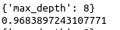
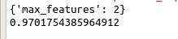
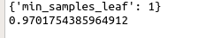
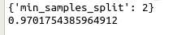
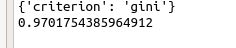
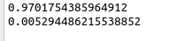

# 随机森林在sklearn中的实现

## 随机森林概述

### 集成算法概述
集成学习(ensemble learning)是时下非常流行的机器学习算法,它本身不是一个单独的机器学习算法,而是通过在数据上构建多个模型,集成所有的模型的结果.基本上所有的机器学习领域都可以看到集成学习的身影，在
现实中集成学习也有相当大的作用，它可以用来做市场营销模拟的建模，统计客户来源，保留和流失，也可用来预测疾病的险和病患者的易感性。在现在的各种算法竞赛中，随机森林，梯度提升树（GBDT），Xgboost等集成算法的身影也随处可见，可见其效果之好，应用之广。

|                                        集成算法的目标                                         |
| ------------------------------------------------------------------------------------------- |
| 集成算法会考虑多个评估器的建模结果,汇总之后得到一个综合的结果,**以此来获取比单个模型更好的回归或分类表现** |

多个模型集成成为的模型叫做集成评估器（ensemble estimator），组成集成评估器的每个模型都叫做基评估器（base estimator）。通常来说，有三类集成算法：装袋法（Bagging），提
升法（Boosting）和stacking。


装袋法的核心思想是构建多个**相互独立的评估器**，然后对其预测进行平均或多数表决原则来决定集成评估器的结
果。装袋法的代表模型就是随机森林。
提升法中，**基评估器是相关的**，是按顺序一一构建的。其核心思想是结合弱评估器的力量一次次对难以评估的样本
进行预测，从而构成一个强评估器。提升法的代表模型有Adaboost和梯度提升树。


### sklearn中的集成算法

- sklearn中的集成算法模块ensemble

|                  类                  |             类的功能              |
| ------------------------------------ | ------------------------------ |
| ensemble.AdaBoostClassifier         | AdaBoost分类                     |
| ensemble.AdaBoostRegressor          | AdaBoost回归                     |
| ensemble.BaggingClassifie           | 装袋分类器                        |
| ensemble.BaggingRegressor           | 袋装回归器                        |
| ensemble.ExtraTreeClassifier        | Extra-trees分类(超树,极端随机树)   |
| ensemble.ExtraTreesRegressor        | Extra-trees回归                  |
| ensemble.GradientBoostClassifier    | 梯度提升分类                     |
| ensemble.GradientBoostRegressor     | 梯度提升回归                     |
| ensemble.IsolationForest            | 隔离森林                          |
| **ensemble.RandomForestClassifier** | **随机森林分类**                  |
| **ensemble.RandomForestRegressor**  | **随机森林回归**                  |
| ensemble.RandomTreesEmbedding       | 完全随机树的集成                   |
| ensemble.VotingClassifier           | 用于不适估算器的软投票/多数规则分类器 |

集成算法中,有一半以上都是树的集成模型,可以想见决策树在集成中必定有很好的效果.

## RandomForestClassifier
```
class sklearn.ensemble.RandomForestClassifier (n_estimators=’10’, criterion=’gini’, max_depth=None,
min_samples_split=2, min_samples_leaf=1, min_weight_fraction_leaf=0.0, max_features=’auto’,
max_leaf_nodes=None, min_impurity_decrease=0.0, min_impurity_split=None, bootstrap=True, oob_score=False,
n_jobs=None, random_state=None, verbose=0, warm_start=False, class_weight=None)
```
随机森林是非常具有代表性的Bagging集成算法，它的所有基评估器都是决策树，分类树组成的森林就叫做随机森
林分类器，回归树所集成的森林就叫做随机森林回归器。这一节主要讲解RandomForestClassifier，随机森林分类
器

### 重要参数
#### 控制基评估器的参数
|          参数          |                                        含义                                         |
| --------------------- | ---------------------------------------------------------------------------------- |
| criterion             | 不纯度的衡量指标,有基尼系数和信息熵两种选择                                               |
| max_depth             | 树的最大深度,超过最大深度的树都会被剪枝                                                  |
| min_samples_leaf      | 一个节点在分之后每个子节点都必须包含至少min_samples_leaf个训练样本,否则不分枝               |
| min_samples_split     | 一个节点必须要包含至少min_samples_split个训练样本,这个节点才允许被分枝,否则分枝就不会产生    |
| max_features          | max_features限制分枝时考虑的特征个数,超过限制个数的特征都会被舍弃,默认值为总特征数的开平方取整 |
| min_impurity_decrease | 限制信息增益的大小,信息增益小于设定数值就不会分枝                                         |

#### n_estimators
这是随机森林的数量,即基评估器的数量,这个参数对随机森林模型的精确性影响是单调的,**n_estimators越大,模型的效果往往越好** . 但是相应的,任何模型都有决策边界,n_estimators到达一定程度之后,随机森林的精确性往往不再上升或开始波动.
并且，n_estimators越大，需要的计算量和内存也越大，训练的时间也会越来越长。对于这个参数，我们是渴望在训练难度和模型效果之间取得平衡


### 重要属性和接口
随机森林有三个非常重要的属性:`.estimators_`,`.oob_score_`以及`.feature_importance_`.

`.estmators_`是用来查看随机森林中所有树的列表的.

`.oob_score_`指的是袋外得分. 随机森林为了确保林中的每棵树都不尽相同,所以采用了对训练集进行有放回抽样的方式来不断组成新的训练集,在这个过程中,会有一些数据从来没被随机挑选到,他们就叫做`"袋外数据"`.这些袋外数据,没有被模型用来进行训练,sklearn可以帮助我们用他们来测试模型,测试的结果就有这个属性`obb_score`来导出,本质上还是模型的精确度.

而`.feature_importances_`和决策树中的`.feature_importances_`用法和含义都一致,是返回特征的重要性.

随机森林的接口和决策树完全一致,因此依然有四个常用的接口:`apply`,` fit`,`predict`和`score`.除此之外，还需要注意随机森林的predict_proba接口，这个接口返回每个测试样本对应的被分到每一类标签的概率，标签有几个分类就返回几个概率。如果是二分类问题，则predict_proba返回的数值大于0.5的，被分为1，小于0.5的，被分为0。传统的随机森林是利用袋装法中的规则，平均或少数服从多数来决定集成的结果，而sklearn中的随机森林是平均每个样本对应的predict_proba返回的概率，得到一个平均概率，从而决定测试样本的分类


## 随机森林在乳腺癌数据上的调参


**1.导入需要的库**
```python
from sklearn.datasets import load_breast_cancer
from sklearn.ensemble import RandmomForestClassifier
from sklearn.model_selection import GridSearchCV
from sklearn.model_selection import cross_val_score
import matplotlibl.pyplot as plt
import pandas as pd
import numpy as np
```
**2.导入数据集,探索数据**
```Python
data = load_breast_cancer()
data
data.data.shape
data.target
# 可以看出,乳腺癌数据集中有569条记录,30个特征,单看维度虽然不高,但是样本量非常少.过拟合的情况可能存在.
```

**3.进行一次简单的建模,看看模型本身在数据集上的效果**
```Python
rfc = RandomForestClassifier(n_estimators=100,radom_state=90)
score_pre = cross_val_score(rfc,data.data,data.target,cv=10).mean()

score_pre
# 这里可以看到,随机森林在乳腺癌数据上的表现本就还不错,在现实数据集上,基本上不可能什么都不调就看到95%以上的准确率
```

**4.随机森林调整的第一步:无论如何先来调n_estimators**

```python
"""
在这里我们选择学习曲线,可以使用网格搜索吗?可以,但是只有学习曲线,才能看见趋势,我个人倾向是,要先看见n_estimators在什么取值开始变得平稳,是否一直推动模型准确率上升到的信息.
第一次的学习曲线,可以先用来帮助我们划定范围,我们取每十个数作为一个阶段,来观察n_estimators的变化如何引起模型整体准确率的
"""
scorel = []
for i in range(0,200,10):
    rfc = RandomForestClassifier(n_estimators=i+1,
                                 n_jobs=-1,
                                 random_state=90)
    score = cross_val_score(rfc,data.data,data.target,cv=10).mean()
    scorel.append(score)
print(max(scorel),(scorel.index(max(scorel))*10)+1)    
plt.figure(figsize=[20,5])
plt.plot(range(1,201,10),scorel)
plt.show()
```


**5.在确定好的范围内,进一步细化学习曲线**

```python
scorel = []
for i in range(65,80):
    rfc = RandomForestClassifier(n_estimators=i+1,
                                 n_jobs=-1,
                                 random_state=90)
    score = cross_val_score(rfc,data.data,data.target,cv=10).mean()
    scorel.append(score)

print(max(scorel),([*range(65,80)][scorel.index(max(scorel))]))
plt.figure(figsize=[20,5])
plt.plot(range(65,80),scorel)
plt.show()

```


调整n_estimators的效果显著,模型的准确率立即上升了0.003.接下来就进入网格搜索,我们将使用网格搜索对参数一个个进行调整.在这里为了使用复杂度-泛化误差方法(方差-偏差方法),我们对参数进行一个个地调整

**6.为网格搜索做准备,书写网格搜索的参数**

```
有一些参数是没有参照的,很难说清一个范围,这种情况下我们使用学习曲线,看趋势从曲线跑出的结果中选择一个更小的区间,再跑曲线

param_grid = {'n_estimators':np.arrange(0,200,10)}

param_grid = {'max_depth':np.arange(1,20,1)}

param_grid = {'max_leaf_nodes':np.arrange(25,50,1)}

对于大型数据集,可以尝试从1000来构建,先输入1000,每100个叶子一个区间,再缩小范围

有一些参数是可以找到一个范围的,或者说我们知道他们的取值和随着他们的取值,模型的整体准确率会如何变化,这样的参数我们就可直接跑网格搜索

param_grid = {'criterion':['gini','entropy']}

param_grid = {'min_samples_split':np.arrange(2,2+20,1)}

param_grid = {'min_samples_leaf':np.arrange(1,1+10,1)}

param_grid = {'max_features':np.arange(5,30,1)}

```

**7.开始按照参数对模型整体准确率的影响程度进行调参,首先调整max_depth**

```python
param_grid = {'max_depth':np.arange(1,20,1)}
rfc = RandomForestClassifier(n_estimators=72,
                             random_state=90)
GS = GridSearchCV(rfc,param_grid,cv=10)
GS.fit(data.data,data.target)

GS.best_params_
GS.best_score_

```



在这里,我们注意到,将max_depth设置为有限之后,模型的准确率上升了.限制max_depth,让模型变得简单,把模型往左推,而模型的整体的准确率上升了.即整体的泛化误差下降了,说明模型现在位于图像的右边,即泛化误差最低点的右边(偏差为主导的一边). 通常来讲,随机森林应该在泛化误差最低点的右边,树模型倾向于过拟合.

当模型位于图像右侧时,我们需要的是减少模型的复杂度(减少方差,增加偏差)的选项,因此max_depth尽可能小,min_samples_leaf和min_samples_split尽可能大.以减少模型的复杂度.


如果模型位于图像左侧,与上面正好相反,max_depth应该尽可能大,以增加模型复杂度.而`min_samples_leaf`和`min_samples_split`应该尽可能小,除了`max_feature`外我们没有任何参数可以调整了,因为`min_samples_leaf`和`min_samples_split`即`max_depth`都是剪枝参数,是减小复杂度的参数.我们就可以预言,我们已经非常接近模型的上限了,模型很可能没有办法进步了.


**8.调整max_features**

```python
param_grid = {'max_features':np.arange(1,30,1)}
rfc = RandomForestClassifier(n_estimators=72,
                             random_state=90,
                             max_depth=8)
GS = GridSearchCV(rfc,param_grid,cv=10)
GS.fit(data.data,data.target)

print(GS.best_params_)
print(GS.best_score_)

```




网格搜索返回了`max_features`的最小值,可见在`max_feature`下降之后,模型的准确率得到了提升.这说明我们把模型往左推,模型的泛化误差减少了.


**7.调整min_samples_leaf**

```python

param_grid = {'min_samples_leaf':np.arange(1,1+10,1)}

rfc = RandomForestClassifier(n_estimators=72,
                             max_depth=8,
                             max_features=2,
                             random_state=90)
GS = GridSearchCV(rfc,param_grid,cv=10)
GS.fit(data.data,data.target)
print(GS.best_params_)
print(GS.best_score_)

```
- 对于`min_samples_leaf`和`min_samples_split`,一般是从他们的最小值开始向上增加10或20
- 面对高纬度高样本量数据,如果不放心,也可以直接+50,对于大型数据,可能需要200~300的范围
- 如果调整的时候发现准确率无论如何都上不来,那可以放心大胆的调一个很大的数据,大力限制模型的复杂度.



可以看见,网格搜索返回了`min_samples_leaf`的最小值,但是模型的整体准确率没有变化,这种情况下我们可不设置这个参数,保值默认就好.


**10.不懈努力,继续尝试min_samples_split**

```python
param_grid = {'min_samples_split':np.arange(2,2+20,1)}
rfc = RandomForestClassifier(n_estimators=72,
                             max_depth=8,
                             max_features=2,
                             random_state=90)

GS = GridSearchCV(rfc,param_grid,cv=10)
GS.fit(data.data,data.target)
print(GS.best_params_)
print(GS.best_score_)
```


和`min_samples_leaf`结果一样,模型的整体准确率不变.

**11.最后尝试一下criterion**

```python
param_grid = {'criterion':['gini','entropy']}
rfc = RandomForestClassifier(n_estimators=72,
                             max_depth=8,
                             max_features=2,
                             random_state=90)

GS = GridSearchCV(rfc,param_grid,cv=10)
GS.fit(data.data,data.target)

print(GS.best_params_)
print(GS.best_score_)

```



随机森利默认的`criterion`就是`gini`.所以这个参数也不需要调

**12.调整完毕,总结出模型的最佳参数**

```Python
# 最佳参数
rfc = RandomForestClassifier(n_estimators=72,
                             max_depth=8,
                             max_features=2,
                             random_state=90)

score = cross_val_score(rfc,data.data,data.target,cv=10).mean()
print(score)
print(score-score_pre)

```



在整个调参过程中,我们首先调整了`n_estimators`(无论如何都请先走这一步),然后调整`max_depth`,通过`max_depth`产生的结果,来判断模型位于复杂度-泛化误差图像的哪一边,从而选择我们应该调整的参数和调参的方向.
如果产生困惑,也可以画很多学习曲线来观察参数如何影响我们的准确率,选取学习曲线中单调的部分来方法研究(如同我们对n_estimators做的).学习曲线的拐点也许就是我们一直在追求的.最佳复杂度对应的泛化误差最低点(也是方差和偏差的平衡点).

网格搜索也可以一起调整很多参数