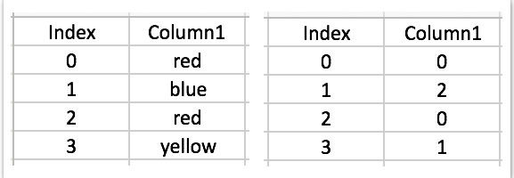
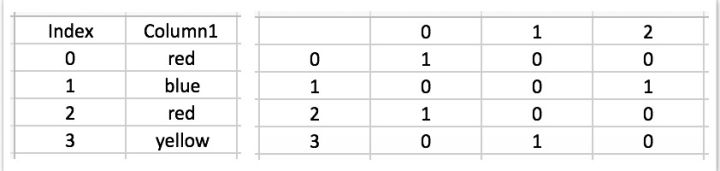

# 数据预处理之将类别数据数字化的方法 -- LabelEncoder VS OneHotEncoder

## LabelEncoder 和 OneHotEncoder 是什么
在数据处理过程中，我们有时需要对不连续的数字或者文本进行数字化处理。
在使用 Python 进行数据处理时，用 encoder 来转化 dummy variable（虚拟数据）非常简便，encoder 可以将数据集中的文本转化成0或1的数值。
LabelEncoder 和 OneHotEncoder 是 scikit-learn 包中的两个功能，可以实现上述的转化过程。
sklearn.preprocessing.OneHotEncoder 的官方介绍：LabelEncoder
sklearn.preprocessing.OneHotEncoder 的官方介绍：OneHotEnncoder

## 数据集中的类别数据
在使用回归模型和机器学习模型时，所有的考察数据都是数值更容易得到好的结果。因为回归和机器学习都是基于数学函数方法的，所以当我们要分析的数据集中出现了类别数据(categorical data)，此时的数据是不理想的，因为我们不能用数学的方法处理它们。例如，在处理男和女两个性别数据时，我们用0和1将其代替，再进行分析。由于这种情况的出现，我们需要可以将文字数字化的现成方法。

##  LabelEncoder 和 OneHotEncoder 的例子
下面是一个使用 Python sci-kit 包中 LableEncoder 和 OneHotEncoder 的具体例子：


- 首先，我们需要创建一个变量 encoder_x 来进行编码工作。
- 程序执行过后，我们的类别数据就被转化成了数值0、1、2、3.
- 显然这种结果还不理想，因为计算机会对这些数值进行对比，例如2比1大，3比2也大，不利于我们进行数据分析。所以我们需要对这些数值进行再次的处理，得到一些虚拟数据。
- 接下来我们就需要借助 OneHotEncoder 来创造一些虚拟数据。
- OneHotEncoder 可以把数据分成多个不同的列，每一列都用0或1来表示。
- 使用 OneHotEncoder 时，我们需要指明要处理的列。在这个例子中，我们想对第一列虚拟数据进行编码处理，所以我们设定 `categorical_features` 中的 `index＝0`。
下面是具体代码：

```python
from sklearn.preprocessing import LabelEncoder, OneHotEncoder
encoder_x=LabelEncoder()
x[:,0]=encoder_x.fit_transform(x[:,0])
onehotencoder = onehotencoder(categorical_features = [0])
x=onehotencoder.fit_transform(x).toarray()
x=[:,1:]
```


## 远离虚拟数据陷阱
- 如果数据集里面有一个以上的虚拟变量，而且这些虚拟变量之间又有联系，这样的数据集被数字化编码以后就容易掉入虚拟数据陷阱。
- 在上面的例子中，如果被分析变量不是 b, c 或 d，那么一定就是 a! 所以就会出现虚拟变量陷阱，这个陷阱的实质其实就是完全共线性。（矩阵不是满秩的）
- 接下来，我们需要去掉虚拟变量中的一列。也就是说，如果有 m 个定性变量，我们就引入 m-1 个虚拟变量。
- 代码的最后一行 x=[:,1:] 作用是，从第1列开始复制数据中的所有行和所有列。
- 至此，第一列哑数据被去除了，虚拟数据陷阱就得以避免了。


## LabelEncoder 和 OneHotEncoder 的区别
- LabelEncoder 将一列文本数据转化成数值。
- 例如，[red, blue, red, yellow] = [0,2,0,1]



- OneHotEncoder 将一列文本数据转化成一列或多列只有0和1的数据。
- 例如，[red, blue, red, yellow] = [1,2,1,3] 会被转化成3列用0和1表示的数据列，如下图：



