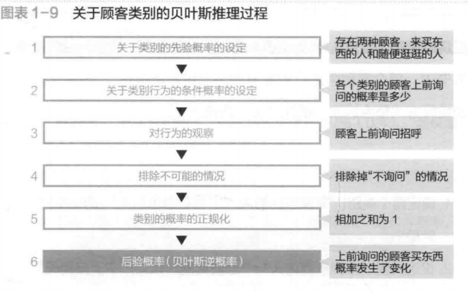
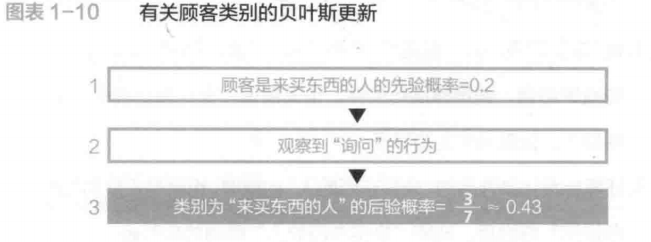
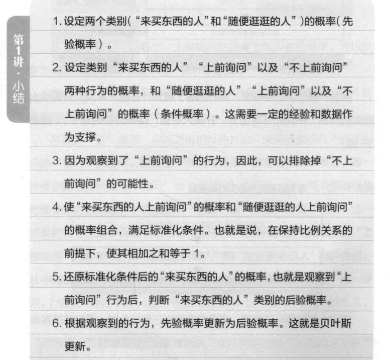

# 贝叶斯(统计学管我什么事:生活中的极简统计学)

贝叶斯统计的优势在于,"在数据少的情况下也可以进行推测,数据越多,推测结果越准确",以及"对所获的信息可做出瞬时反应,自动升级推测"的学习功能.

那么通过后验概率,我们能够了解到什么呢?其实,只要抽出图表的开头, 中间和结尾部分,并填入数值,结果就很明确了.

看到这个图表便可了解到,在没有观察到任何行为时,面前的顾客是"来买东西的人"的概率为0.2(先验概率),但观察到"上前询问"这一行为之后,数值便更新为约0.43(后验概率).也就是说,虽然并不能断定这位顾客就是"来买东西的人",但是这一结果的**可能性提高到了以前的两倍**,这便是**"贝叶斯更新"**.

上述过程被称为`贝叶斯推理`.贝叶斯推理可以总结为:
`通过观察行动(信息),将先验概率通过贝叶斯更新,转换为后验概率`.

在本书中,每个案例进行的推算称为"贝叶斯推理",而将这些案例中的推算方法整合起来,便是"贝叶斯统计学".

