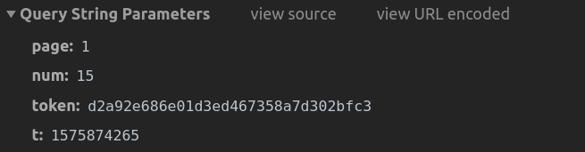
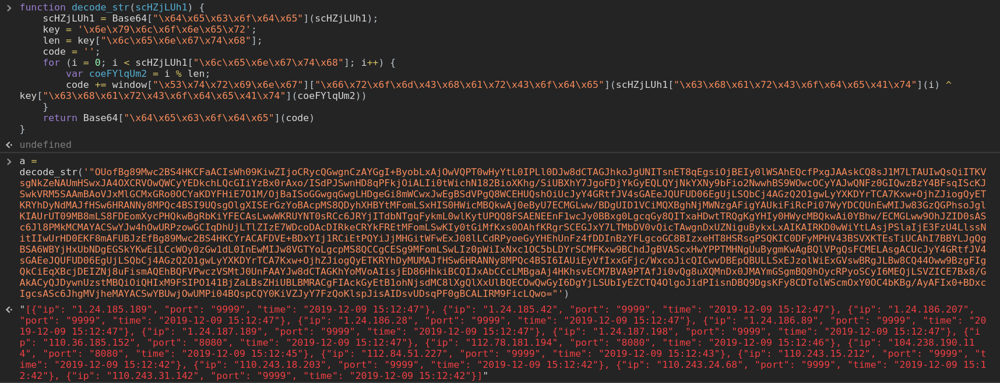

# 零点ip代理网站js逆向

## 目标分析
网站：https://nyloner.cn/proxy

打开网站-》打开控制台-》切换至 XHR

刷新后如下所示：


所以，这里需要解决两个问题：
- 接口返回的密文处理
- 请求中的token

接下来定位加解密位置

## 定位加密位置与分析加密

第一步，搜索加密参数名 token 

`ctl+shift+F`打开搜索框，搜索`token`关键字，如下：


按照搜索结果的文件名，也能 猜出来是第二个结果，点击打开就可以看到 token 的生成代码


`var token = md5(String(page)+String(num)+String(timestamp));`

这段加密函数可以用js实现也可以使用python实现，由于加密简单，我们使用python重写加密过程：
```python
from hashlib import md5

def md5Value(s):
    a = md5(s.encode()).hexdigest()
    return a
```
验证一下：



```python
from hashlib import md5

def md5Value(s):
    a = md5(s.encode()).hexdigest()
    return a
page = 1
num = 15
t = 1575874265

s = str(page) + str(num) + str(t)
s = '1151575874265'
a = md5Value(s)

# d2a92e686e01d3ed467358a7d302bfc3

```
逆向成功！

下面解决返回数据的解密

我们看一下网页源码：


图中 ip 列表的位置是没有数据的，只有 id=“ip-list”，这个唯一的值，所以需要在搜索一下：

追进去之后就可以看到下面的代码了：


打断点，执行两部可以看到 decode_str 后就开始出现我们需要的数据了，所以这里的 `decode_str` 就是我们需要解密的方法：


`decode_str`函数如上；
将它复制到编辑器里调试运行一下：



到这里，被加密的信息被解出来了。

