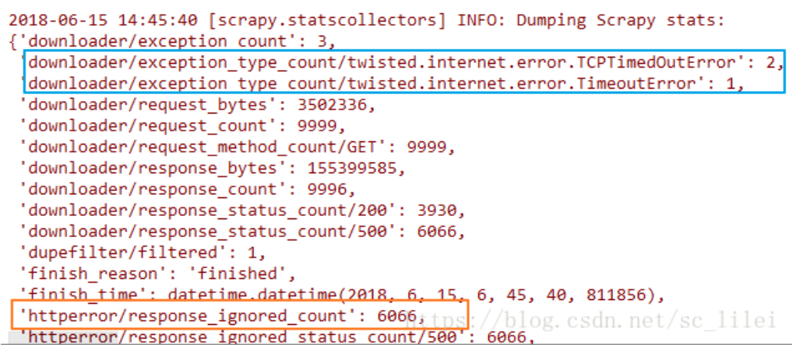
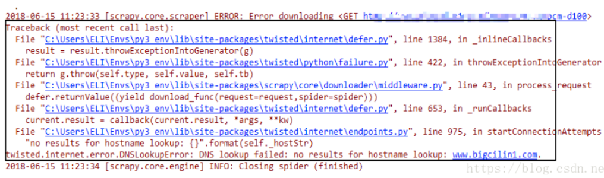

### [scrapy使用技巧]如何在scrapy中捕获并处理各种异常

#### 前言

使用scrapy进行大型爬取任务的时候（爬取耗时以天为单位），无论主机网速多好，爬完之后总会发现scrapy日志中的“item_scraped_count”不等于预先的种子数量，总有一部分种子爬取失败，失败的类型可能有如下图两种（下图为scrapy爬取完成时的日志）：



scrapy中常见的异常包括但不限于：downloader error（蓝色区域），http code 403/500(橙色区域)。

不管是哪种异常，我们都可以参考scrapy自带的retry中间件写法来编写自己的中间件。

#### **正文**

使用IDE，现在scrapy项目中任意一个文件敲上以下代码：

``` python
from scrapy.downloadermiddleware.retry import RetryMiddleware
```

按住ctrl键，鼠标左键点击RetryMiddlerware进入该中间件的文件位置，路径是packages/scrapy/downloadermiddlewares/retry.RetryMiddleware

该中间件的源代码如下：

```python
class RetryMiddleware(object):
 
    # IOError is raised by the HttpCompression middleware when trying to
    # decompress an empty response
    EXCEPTIONS_TO_RETRY = (defer.TimeoutError, TimeoutError, DNSLookupError,
                           ConnectionRefusedError, ConnectionDone, ConnectError,
                           ConnectionLost, TCPTimedOutError, ResponseFailed,
                           IOError, TunnelError)
 
    def __init__(self, settings):
        if not settings.getbool('RETRY_ENABLED'):
            raise NotConfigured
        self.max_retry_times = settings.getint('RETRY_TIMES')
        self.retry_http_codes = set(int(x) for x in settings.getlist('RETRY_HTTP_CODES'))
        self.priority_adjust = settings.getint('RETRY_PRIORITY_ADJUST')
 
    @classmethod
    def from_crawler(cls, crawler):
        return cls(crawler.settings)
 
    def process_response(self, request, response, spider):
        if request.meta.get('dont_retry', False):
            return response
        if response.status in self.retry_http_codes:
            reason = response_status_message(response.status)
            return self._retry(request, reason, spider) or response
        return response
 
    def process_exception(self, request, exception, spider):
        if isinstance(exception, self.EXCEPTIONS_TO_RETRY) \
                and not request.meta.get('dont_retry', False):
            return self._retry(request, exception, spider)
 
    def _retry(self, request, reason, spider):
        retries = request.meta.get('retry_times', 0) + 1
 
        retry_times = self.max_retry_times
 
        if 'max_retry_times' in request.meta:
            retry_times = request.meta['max_retry_times']
 
        stats = spider.crawler.stats
        if retries <= retry_times:
            logger.debug("Retrying %(request)s (failed %(retries)d times): %(reason)s",
                         {'request': request, 'retries': retries, 'reason': reason},
                         extra={'spider': spider})
            retryreq = request.copy()
            retryreq.meta['retry_times'] = retries
            retryreq.dont_filter = True
            retryreq.priority = request.priority + self.priority_adjust
 
            if isinstance(reason, Exception):
                reason = global_object_name(reason.__class__)
 
            stats.inc_value('retry/count')
            stats.inc_value('retry/reason_count/%s' % reason)
            return retryreq
        else:
            stats.inc_value('retry/max_reached')
            logger.debug("Gave up retrying %(request)s (failed %(retries)d times): %(reason)s",
                         {'request': request, 'retries': retries, 'reason': reason},
                         extra={'spider': spider})

```

查看源码我们可以发现，对于返回的http code的response，该中间件会通过process_response方法来处理，处理办法比较简单，大概是判断response.status是否在定义好的self.retry_http_codes集合中，通过向前查找，这个集合是一个列表，定义在default_settings.py文件中，定义如下：

```python
RETRY_HTTP_CODES = [500, 502, 503, 504, 522, 524, 408]
```

也就是先判断http code是否在这个集合中，如果在，就进入retry的逻辑，不在集合中就直接return response。

这样就已经实现对返回的http code但异常的response处理了。


但是对于另一种异常的处理方式就不一样了，刚才的异常准确的说是属于HTTP请求error（超时），而另一种异常发生的时候则是如下图这种实实在在的代码异常（不处理的 话）：



你可以创建一个scrapy项目，start_url中填入一个无效的url即可模拟出此类异常。比较方便的是，在RetryMiddleware中同样提供了对这类异常的处理办法：process_exception


通过查看源码，可以分析出大概的处理逻辑：同样先定义一个集合存放所有异常类型，然后判断传入的异常是否存在于该集合中，如果在（不分析dont try）就进入了retry的逻辑，不在就忽略。


现在已经了解了scrapy是如何捕捉异常了，大概的思路也就应该有了，下面贴出一个实用的异常处理的中间件模板：

```python
from twisted.internet import defer
from twisted.internet.error import TimeoutError, DNSLookupError, \
    ConnectionRefusedError, ConnectionDone, ConnectError, \
    ConnectionLost, TCPTimedOutError
from scrapy.http import HtmlResponse
from twisted.web.client import ResponseFailed
from scrapy.core.downloader.handlers.http11 import TunnelError
 
class ProcessAllExceptionMiddleware(object):
    ALL_EXCEPTIONS = (defer.TimeoutError, TimeoutError, DNSLookupError,
                      ConnectionRefusedError, ConnectionDone, ConnectError,
                      ConnectionLost, TCPTimedOutError, ResponseFailed,
                      IOError, TunnelError)
    def process_response(self,request,response,spider):
        #捕获状态码为40x/50x的response
        if str(response.status).startswith('4') or str(response.status).startswith('5'):
            #随意封装，直接返回response，spider代码中根据url==''来处理response
            response = HtmlResponse(url='')
            return response
        #其他状态码不处理
        return response
    def process_exception(self,request,exception,spider):
        #捕获几乎所有的异常
        if isinstance(exception, self.ALL_EXCEPTIONS):
            #在日志中打印异常类型
            print('Got exception: %s' % (exception))
            #随意封装一个response，返回给spider
            response = HtmlResponse(url='exception')
            return response
        #打印出未捕获到的异常
        print('not contained exception: %s'%exception)
```

Note:该中间件的Order_code不能过大，如果过大就会越接近下载器，就会优先于RetryMiddleware处理response，但是这个中间件是用来兜底的，即当一个response 500进入中间件链时，需要先经过retry中间件处理，不能先由我们写的中间件来处理，它不具有retry的功能，接收到的500response就直接放弃request直接return了，这是不合理的。只有经过retry后仍然异常的request才应当由我们的中间件来处理，这个时候你怎么处理都可以 ，比如再次的retry、return一个重新构造的response。

验证该中间件后达到预期：即使程序运行时抛出异常也能被捕获并处理