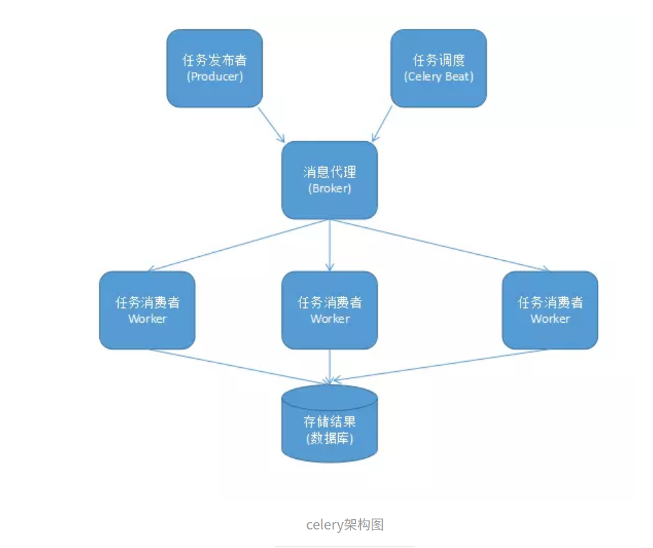

### celery的简介与使用

#### celery的简介

celery是一个基于分布式消息传输的异步任务队列，它专注于实时处理，同时也支持任务调度。它的执行单元为任务（task），利用多线程，如Eventlet，gevent等，它们能被并发的执行在单个或多个服务器上。任务是异步执行（后台运行）或同步执行（等待任务完成）

在生产系统中，celery能够一天处理上百万的任务。它的完整构架如下图：

组件介绍：

- Producer：调用了Celery提供的API、函数或者装饰器而产生任务并交给任务队列处理的都是任务生产者。
- Celery Beat：任务调度器，Beat进程会读取配置文件的内容，周期性的将配置中到期需要执行的任务发送给任务队列。
- Broker：消息代理，又称为消息中间件，接受任务生产者发送过来的任务消息，存进队列再按顺序分发给任务消费方（通常是消息队列或者数据库）。Celery目前支持RabbitMQ、Redis、MongoDB、Beanstalk、SQLAlchemy、Zookeeper等作为消息代理，但适用于生产环境的只有RabbitMQ和Redis，官方推荐RabbitMQ。
- Celery Worker：执行任务的消费者，通常会在多台服务器运行多个消费者来提高执行效率
- Result Backend：任务处理完后保存状态信息和结果，以供查询。Celery默认已支持Redis、RabbitMQ、MongoDB、Django ORM、SQLAlchemy等方式。

在客户端和消费者之间传输数据需要序列化和反序列化。Celery支持的序列化方案如下所示：

#### 准备工作

在本文中，我们使用celery的消息代理和后端存储数据库都使用redis，序列化和反序列化选择msgpack。

